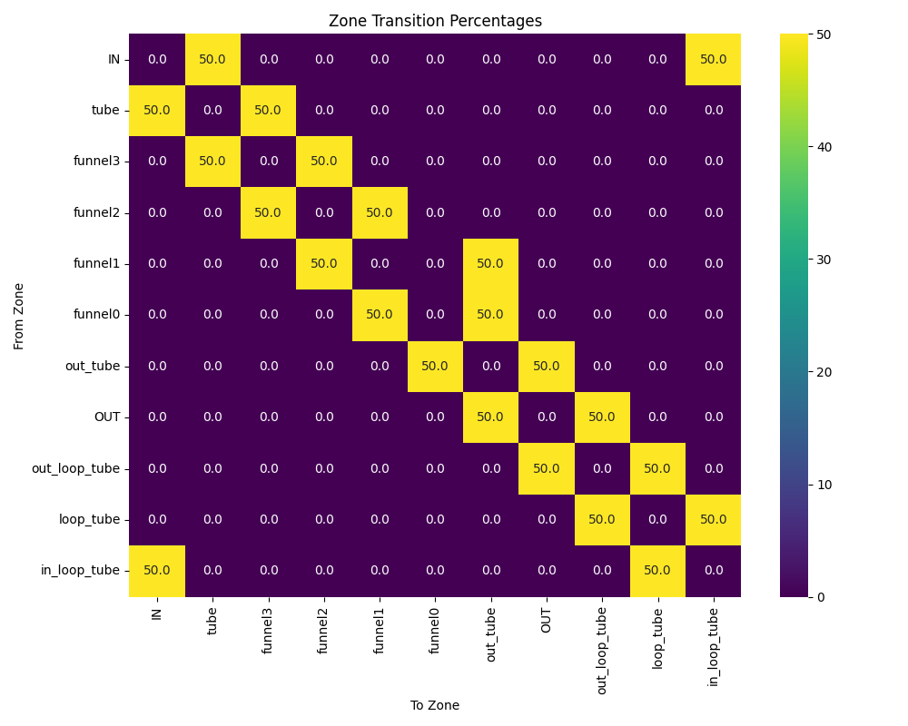
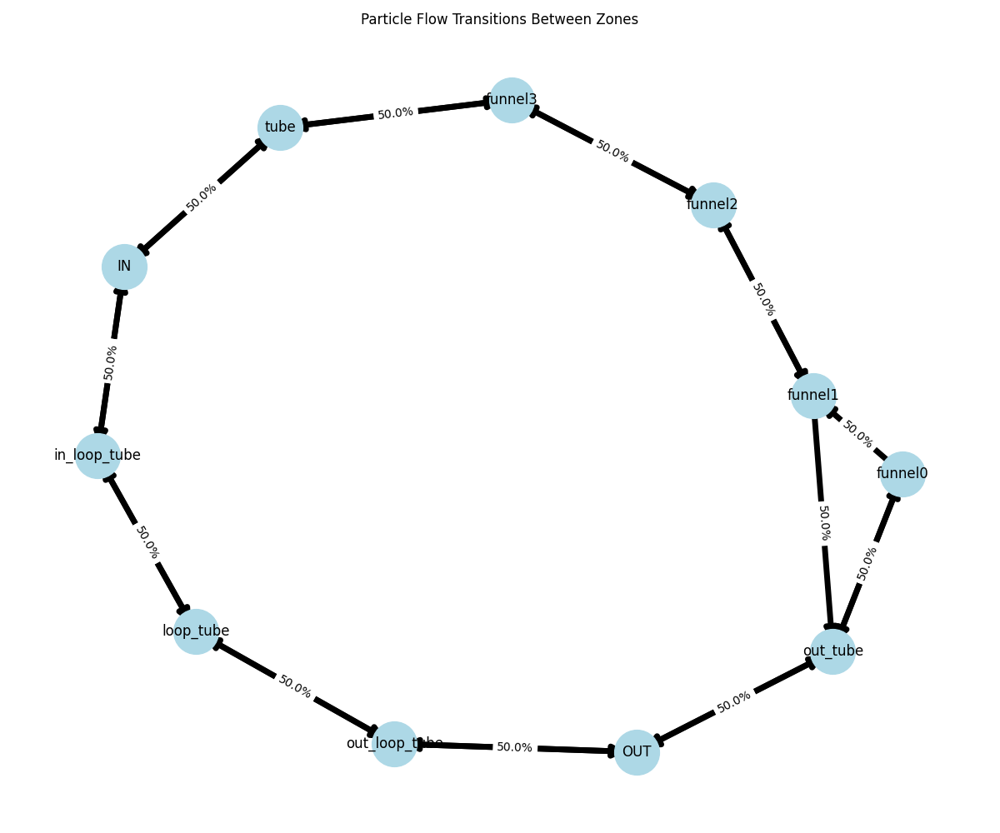
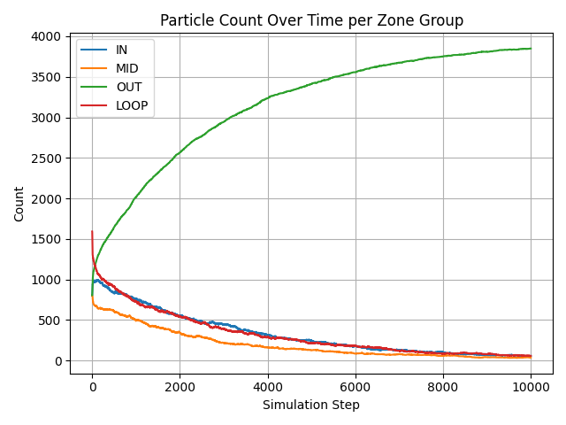
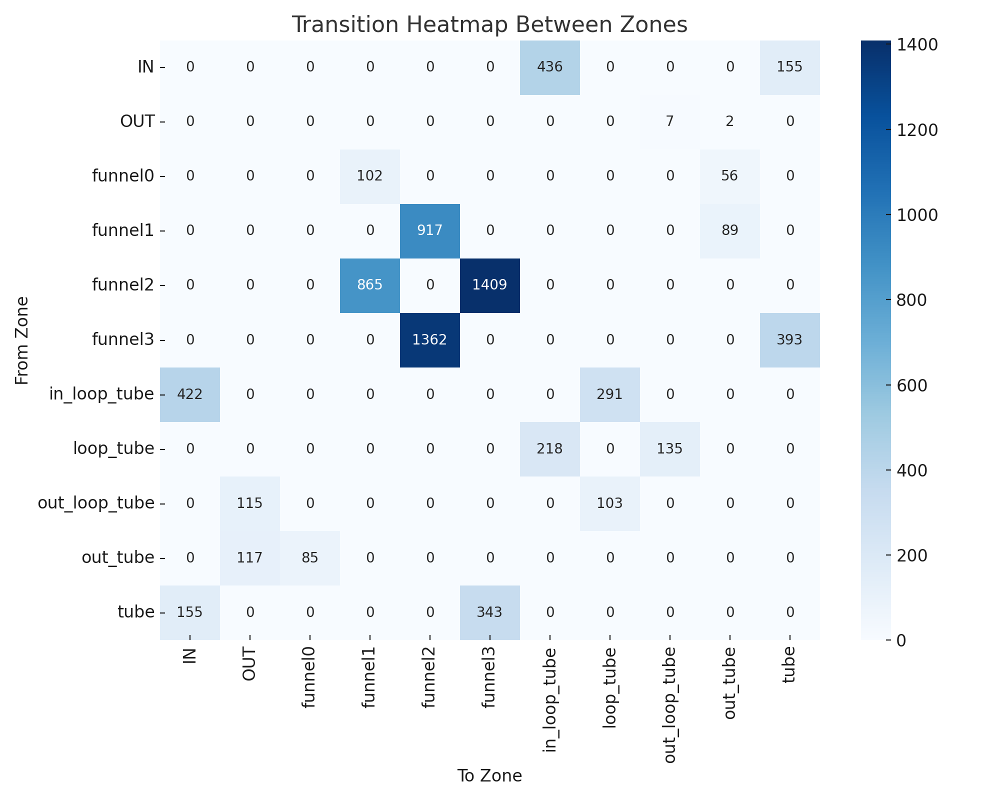
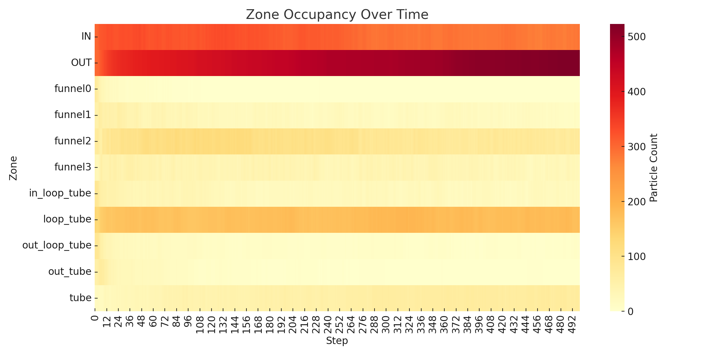

# 🔬 NanoFlowModel — Scientific Research Hub

This repository documents the development of **NanoFlowModel**, a theoretical and experimental framework exploring whether Brownian motion can be geometrically biased and harvested for directional energy and motion — with implications in smart environments, passive cooling, and nano-propulsion systems.

---

## 📂 Documentation Structure

### 🧭 00 – Introduction

Overview of the hypothesis: transforming chaotic motion into directional flow using geometry and particle-environment interaction.

### 🔬 01 – Physics Context

Scientific foundations: Brownian motion, statistical mechanics, ratchet theory, Fokker–Planck dynamics, Bernoulli flow, and thermodynamic analogies.

### 🧪 02 – Experiment Log

Step-by-step digital simulations:

- Test001 – Uniform Brownian Box
- Test002 – Dual-Wall Asymmetry
- Test003 – Heat Drift Geometry (Smart Cooling)
- Test004 – Terrace Wall Drift (Passive Cooling)
- Test005 – Flow Amplifier Chamber
- Test006 – Cascade Flow Amplifier (Multi-Chamber Elastic Amplification)
- Test007 – Adaptive Geometry Flow (Dynamic Chamber Modulation)
- Test008 - Loop Flow Amplifier

### 📊 03 – Results

Summary tables and data plots, including particle trajectories, accumulation patterns, and mean drift behavior.

### 🚀 04 – Future Plans & Applications

Envisioned use cases: passive environmental control, nano-energy harvesting, and autonomous drive propulsion.

### 🧠 05 – Theoretical Framework & Simulation Models

Analytical models used: Langevin dynamics, Fokker–Planck equations, continuity of particle flux, and Brownian energy gradients.

---

## 📎 Additional Materials

- 🗂️ Link Index & Navigation
- 📚 Scientific Papers & References
- 📄 Thesis Draft — work-in-progress bachelor thesis
- 🎴 NanoFlow Poetic Reflection

---

# Internal and External Links

## 🔗 Related Repositories

- vortex-box-test (GitHub)
- flow-bias-walls
- fractal-tube-model

## 📂 Internal Navigation

- 📘 Index
- 📄 Introduction
- 📄 Physics Context
- 📄 Experimental Log
- 📄 Results
- 📄 References
- 📄 Future Plans
- 📁 Simulation Results
- 📜 Poetic Reflection

## 📐 Models and Equations

- Theoretical Framework and Simulation Model

## 📄 Drafts and Deliverables

- 🎓 Bachelor Thesis Draft

# Introduction

NanoFlowModel explores whether structured environments can produce net motion or energy alignment from random Brownian motion — **without external energy inputs**.

The idea is inspired by biological systems (intestines, blood vessels), and scientific concepts like the **Brownian ratchet**, **entropic traps**, and **thermal noise rectification**.

This project is also a philosophical and engineering exploration: can "design alone" act as an ordering mechanism for chaos?

# Physics Context

This document outlines the core physical principles behind the NanoFlowModel project, which investigates how random Brownian motion can be guided and shaped by geometry, material design, and boundary asymmetry.

## Key Concepts

- **Brownian motion**: Random movement of particles due to thermal fluctuations. At the microscale, particles suspended in a fluid undergo unpredictable trajectories, resulting from collisions with surrounding molecules.

- **Brownian ratchet**: A theoretical mechanism (Feynman–Smoluchowski ratchet) that attempts to convert random thermal motion into directional motion using asymmetric barriers. Proven not to produce net work in equilibrium, but inspires modern nanoscale transport models.

- **Entropic barriers**: Geometric constraints (e.g., narrowing channels, traps, valves) that shape the statistical likelihood of particle positions and movement. Such barriers can passively bias random motion, especially in systems out of equilibrium.

- **Bernoulli effect (Venturi horn)**: In fluid dynamics, pressure decreases and velocity increases as a fluid flows through a narrow region. This principle is widely used in nozzles and horn-shaped structures and can be exploited to guide or accelerate random particles using purely passive geometry.

- **Navier–Stokes equations**: Fundamental equations describing the motion of viscous fluids. They capture pressure, velocity, and momentum transport in confined geometries, such as microchannels or nano-tubular systems.

- **Fokker–Planck equation**: A differential equation describing the evolution of the probability distribution for particle positions and velocities over time, particularly useful for analyzing Brownian motion in constrained spaces.

- **Thermodynamic entropy**: A measure of disorder in a system. One key goal of this project is to analyze whether local entropy reduction (in particle spatial distribution) can be induced purely through design, without external forces.

- **Non-equilibrium systems**: Only systems that are out of thermal or chemical equilibrium can produce net transport or perform work from asymmetrical geometry. Otherwise, the second law of thermodynamics prevents any directed motion or energy gain.

- **Laminar flow**: A flow regime in which fluid particles move in parallel layers without disruption between them. In NanoFlowModel, all motion occurs at low Reynolds numbers, making the environment inherently laminar. This condition allows the geometry to influence trajectories reliably, enabling entropic drift and passive directional bias.

## 🔁 Entropic Funnels and Directed Drift

- **Directional confinement**: A structured chamber that includes a nozzle-like exit can create a net bias in particle motion, even in the presence of purely random Brownian dynamics. This is achieved through entropic filtering — particles are more likely to escape in the direction of the geometrical funnel.

- **Flow amplifier behavior**: As observed in **Test005**, when Brownian particles interact with an asymmetrical chamber (dual walls: one reflective, one absorptive), and a strategically positioned exit, a measurable accumulation and evacuation through the funnel can be seen. This is due to the asymmetry combined with geometry-enhanced probability gradients.

- **Related physical principles**:
  - Bernoulli-style geometries
  - Entropic bias and spatial filtering
  - Non-equilibrium drift without external gradients

This observation reinforces the central hypothesis of NanoFlowModel — that **passive geometric constraints** can transform stochastic behavior into **usable directional effects** in fluid or gas microenvironments.

### 🧩 Geometric Influence on Brownian Motion

In classical statistical mechanics, Brownian motion is inherently random and symmetric in all directions within a homogeneous environment. However, when confined to a bounded geometry, particularly one featuring asymmetric or inhomogeneous boundaries, this randomness can be geometrically modulated.

Reflective surfaces can redirect motion; absorbent boundaries can reduce kinetic energy; and converging or diverging geometries can influence particle density and drift direction. These mechanisms are central to rectification theories (e.g., Brownian ratchets) and form the conceptual foundation of the NanoFlowModel, where directional flow is induced solely via structural design.

---

### Revisiting Entropy Near Absolute Zero: A New Thermodynamic Foundation

Recent theoretical work by Prof. José María Martín-Olalla (University of Seville, 2025) has re-established a rigorous connection between the Nernst theorem and the second law of thermodynamics. For over a century, the theorem—stating that entropy exchanges tend to zero as temperature approaches absolute zero—was treated as an independent postulate, decoupled from the second law, notably by Einstein himself.

However, Martín-Olalla's new formalism demonstrates that the theorem is in fact a _direct consequence_ of the second principle, provided one adopts the notion of a hypothetical (virtual) engine that performs no work but is essential for the thermodynamic framework. This engine is purely formal—it doesn't violate the second law, yet allows entropy-based reasoning even in unphysical limits.

This development validates the idea that **entropy distribution and motion constraints** are intimately tied to the system's geometry and theoretical limits. It provides a formal backdrop to studies like ours, where **Brownian motion is geometrically constrained** to induce net flow. Our structural designs echo the logic of Martín-Olalla’s approach: no energy is added to the system, yet directional behavior emerges from **entropy management within bounded, inhomogeneous spaces**.

## Structural Similarities: Fluid Flow and Electromagnetism

Although **Maxwell’s equations** govern classical electromagnetism, their mathematical structure — involving divergence (∇·) and curl (∇×) operators — closely mirrors that of fluid dynamics (e.g., Navier–Stokes equations).

This mathematical similarity appears across:

- Electromagnetic field propagation
- Classical fluid mechanics
- Thermodynamic flow and diffusion
- Quantum hydrodynamics
- Atomic-scale transport systems

This deep structural connection explains why similar equations appear in apparently unrelated areas of physics. The NanoFlowModel project draws from this unity, applying geometric design principles in fluid-like systems to explore emergent order, motion, or flow.

## Thermodynamic Paradoxes and Informational Order

The NanoFlowModel aligns with reflections on entropy, as seen in modern interpretations of the **Second Law of Thermodynamics**. Concepts like **Maxwell’s Demon** and **Landauer’s Principle** reveal how geometric structures may encode passive information selection — a key idea behind our wall interactions and chamber designs.

This resonates with the philosophical notion that **life itself is an entropy accelerator**, optimizing energy dissipation while maintaining local order. NanoFlowModel replicates this dynamic at microscale using purely structural bias — with no external energy input.

Inspired reading: Entropy, Black Holes and Demons – alacrity.education

### Avoiding the Brownian Ratchet Paradox

It is important to distinguish the NanoFlow model from earlier concepts like the Brownian ratchet, famously critiqued by Feynman. In a Brownian ratchet, the failure arises because both the ratchet and pawl are at the same temperature, leading to no net motion due to equilibrium thermal fluctuations.

NanoFlow circumvents this failure mode entirely. It uses no moving parts and does not rely on discrete locking mechanisms. Instead, it creates spatial zones with varying dissipative properties (e.g., elastic vs. absorbing tunnels) to bias the motion of Brownian particles over time.

This passive asymmetry, coupled with stochastic initialization far from equilibrium, allows NanoFlow to operate as a statistical flow rectifier — not a mechanical converter. Therefore, it functions without contradicting thermodynamic constraints.

### Why has a passive net-flow system like NanoFlow not been discovered earlier?

This is a fundamental and fair question.

The main reason is not conceptual, but **technological and material-related**. While the idea of using asymmetric geometry to guide stochastic motion is not new (e.g. Feynman’s ratchet or synthetic Brownian motors), the **specific combination** of design features that define NanoFlow could only be practically realized with **modern advances**:

1. **Material Control**  
   Precise control over surface absorption, elasticity, and reflection was **not available** until recent decades. NanoFlow depends critically on tuning **local dissipation coefficients** (e.g. 0.55×, 0.85×, 1.5×) at micro or nano scale.

2. **Simulation Capabilities**  
   Simulating tens of thousands of particles in detailed geometries to test passive statistical drift required **modern computational tools**. Until the past ~10 years, **verifying such a mechanism** was nearly impossible.

3. **Focus of Research**  
   Most passive transport systems were explored under **strict thermodynamic symmetry assumptions**, or focused on **feedback-driven (active)** mechanisms like optical tweezers, gates, and micro-actuators. The assumption was that **flow requires bias**, not geometry.

4. **Cross-disciplinary Blind Spot**  
   NanoFlow sits between **statistical physics, nanofluidics, and material engineering**. Few projects attempted to explore fully passive, geometric-only methods of inducing net motion in this regime.

As such, **NanoFlow is not a violation of known science**, but rather a product of a **previously unexplored combination of material science, simulation, and passive statistical mechanics**.

It’s not that the principle was unknowable—**the required precision and imagination to test it simply didn’t exist in this form until now**.

## Conclusion

NanoFlowModel is grounded in real physical principles: randomness, entropy, conservation laws, and the geometry of flow. Rather than violating the laws of thermodynamics, it investigates how intelligent structure alone can act as a passive engine of organization in systems rich with thermal energy and fluctuation.

# Experiment Log

## Test 001: Brownian Cube – Uniform Walls

- **Date:** June 18, 2025
- **Repo:** `vortex-box-test`
- **Setup:** All walls reflective. No asymmetry.
- **Outcome:** Uniform distribution. X̄ ≈ 0.0000 m

## Test 002: Brownian Cube – Dual Wall Behavior

- **Date:** June 18, 2025
- **Left walls:** Fully reflective
- **Right walls:** Absorbing (velocity dampened)
- **Result:** ~60–70% particles accumulated in right side
- **X̄:** ≈ +0.03 m
- **Insight:** Geometric asymmetry alone caused spatial bias.

## Test 003 – Heat Drift Geometry (Smart Passive Cooling)

- **Date**: June 18, 2025
- **Type**: Conceptual prototype for passive thermal drift
- **Setup**:
  - 3D rectangular room (~1m³ virtual space)
  - Left wall: reflective
  - Right wall: absorbent
  - Top corner: open drift zone ("chimney exit")
- **Particles**: Simulated air molecules (Brownian agents)
- **Hypothesis**:  
  A geometrically biased interior will passively shift particles (thermal energy) toward an exit zone, simulating passive cooling through boundary-driven accumulation.

- **Expected behavior**:  
  Net drift of particles toward the right-upper corner, where exit/absorption occurs — even without external gradients.

- **Goal**:  
  Demonstrate that asymmetry + boundary design can produce thermal biasing usable in tiny/smart homes.

## Test004 – Terrace Wall Drift (Passive Thermal Repulsion)

- **Date**: June 19, 2025
- **Type**: Digital simulation (from `vortex-box-test` project)
- **Objective**: Evaluate if a terrace-facing reflective wall can induce passive thermal drift
- **Geometry**:

  - 1 m³ virtual box
  - Reflective wall at x = 0 (simulated elastic rebound amplification)
  - Open "exit zone" at x > 0.9 and y > 0.9

- **Key Insight**:
  Elastic acceleration on one side promotes particle movement toward the exit, replicating a cooling effect
  through spatial bias — without any external energy input.

- **Results integrated in**:

  - Results summary
  - Future plans

## 🧪 Test005 – Flow Amplifier Chamber (with Logging)

- **Date**: July 4, 2025
- **Goal**: Test directional particle drift induced by dual-wall asymmetry and a central funnel-type opening.
- **Chamber size**: 40×20×10 units
- **Exit geometry**: 4 units wide, 6 units tall, center-right
- **Particle count**: 100 (initial)
- **Method**: VPython simulation + CSV logging (`test005_flow_amplifier_logged.py`)
- **Outcome**: Directional accumulation and exit were confirmed. See results and plot.

📎 Related files:

- `heat_drift_exit_data.csv`
- `test005_exit_plot.png`
- Simulation source

---

## 🔹 Test006 – Cascade Flow Amplifier

- **Date**: July 9, 2025
- **Configuration**: Three chambers aligned horizontally:
  - `IN` chamber with **two small elastic funnels** directing flow toward `MID`.
  - `MID` chamber with **fully elastic walls** and a single funnel leading to `OUT`.
  - `OUT` chamber with absorptive walls (acts as the terminal collector).
- **Particles**: 1000 per chamber (initial equilibrium distribution).
- **Mechanism**: Funnels and elastic walls promote **biased migration** from left to right.

**Objective**:  
To test whether multi-chamber elastic guidance amplifies net particle drift and supports step-wise accumulation in the final `OUT` chamber.

**Files**:

- Simulation: `test006c_cascade_flow_v5.py`
- Data CSV: `test006c_cascade_flow_v5_data.csv`
- Screenshot: !render
- Plot: !plot

---

## 🔹 Test007 – Passive Amplifier Zone

- **Date**: July 10–12, 2025
- **Goal**: Demonstrate net directional Brownian motion using purely passive geometries with no logical gates, valves, or external bias.
- **Setup Summary**:

  - `IN` chamber: elastic (acceleration 1.2×).
  - `MID` zone: tunnel made from chained cylinders with varying radius and surface type.
  - Tunnels include:
    - **tubIN**: slightly resistive (0.85×)
    - **cylTunnel3 → cylTunnel1**: vary from absorbent to elastic across models.
    - **tubOUT**: strong elastic acceleration (1.5×).
  - `OUT` chamber: strong deceleration (0.55×).

- **Key Variants**:

  - `Model 1–9`: progressive tuning of funnel shape and material.
  - `Model 10`: full absorbing tunnel sequence.
  - `Model 11`: **all tunnels elastic** – _best net flow observed_.
  - `Model 12`: elastic sequence with one absorbing tunnel to contrast.

- **Comparison Experiments**:
  - `symmetric_flow`: symmetric setup → no net movement.
  - `passive_cascade` (Test006): logical valve-like cascade, less efficient than Model 11.

📸 Visual References:

| Configuration Type   | Screenshot |
| -------------------- | ---------- |
| Symmetric (no flow)  | !Symmetric |
| Passive Amplifier 11 | !Amplifier |

📁 Files:

- CSVs: `test007_amplifier_zone_model_[1–12].csv`
- Source: `vortex-box-test/test007_amplifier_zone/`
- Graphs: See `03_results.md` for comparative plots

---

## Test008: Loop Flow Amplifier

- **Date**: July 12–14, 2025
- **Goal**: Demonstrate net directional Brownian motion using purely passive geometries with no logical gates, valves, or external bias.
- **Setup Summary**:

  - `IN` chamber: elastic (acceleration 1.2×)
  - `MID` zone: tunnel made from chained cylinders with varying radius and surface type
  - Tunnels:
    - `tube`: slightly resistive (0.85×)
    - `funnel3 → funnel1`: variable geometry, tuned in different models
    - `funnel0`: connector to output
    - `out_tube`: strong elastic acceleration (1.5×)
  - `OUT` chamber: strong deceleration (0.55×)
  - Loop path (`loop_tube`, `in_loop_tube`, `out_loop_tube`) allows feedback recycling of particles back into the system.

- **Variants Tested**:

  - **Model 1**: neutral loop (no amplification)
  - **Model 2**: strong elastic loop (amplified flow observed)
  - **Model 3**: strong absorbing loop (flow dampened)

- **Result**:
  - Model 2 yielded the **strongest OUT throughput**, confirming that loop elasticity supports directional bias.
  - The system exhibits **fluid-like particle flow**, with measurable zone transitions and repeatable current formation.

!Loop Amplifier

A large-scale model simulating a closed-loop passive structure using only geometrical constraints and elastic/absorbing walls. Designed to test whether directional Brownian motion can be amplified in a loop.

📂 See results  
📈 Transition heatmap  
📈 Flow graph  
📈 Zone evolution

➡️ The experiment demonstrates that **net flow from IN to OUT is possible**, with amplification due to **loop-tube recycling** and **elastic acceleration** through the central funnel.

**Resources:**

- zone_transitions.csv
- test008_loop_flow_model_absorbing_passive_amplification2.csv
- zone_transitions_summary.csv

---

# Experimental Results Summary

| Test # | Description                     | Net Flow         | X̄ Position                       | Notes                                           |
| ------ | ------------------------------- | ---------------- | -------------------------------- | ----------------------------------------------- |
| 001    | Uniform cube                    | None             | ~0.0000 m                        | Baseline for Brownian chaos                     |
| 002    | Dual-wall asymmetry             | Rightward        | ~+0.0300 m                       | Passive entropic accumulation                   |
| 003    | Heat Drift Geometry             | Strong drift     | ~+0.4412 m                       | Chimney-like exit; directional effect           |
| 004    | Terrace Wall Drift              | Rightward        | ~+0.42 m                         | Simulated heat rejection via reflection         |
| 005    | Chamber with directional funnel | Flow Amplifier   | ~36% (Exit % (after 2000 steps)) | !plot                                           |
| 006    | Cascade Amplifier               | Rightward        | ~+0.24 m                         | Multi-stage chambers w/ elastic funnels         |
| 007    | Passive Amplifier Zone          | Strong rightward | ~+0.62 m (Model 11)              | Elastic-only geometry outperforms cascade logic |

---

### Interpretation

The results suggest that **directional accumulation** can occur in completely random systems when **geometric or material asymmetries** are present — a principle that could lead to energy guiding or harvesting systems at the nanoscale.

---

### Test002 – Dual-wall asymmetry

- !📈 plot

---

### Test003 – Heat Drift with Exit

- Extended to 10,000 steps
- Chimney-like exit defined at top-right (x > 0.90, y > 0.90)
- Significant drift detected

Output:

- CSV log
- 📈 Position plot

#### Test003 Results Summary

The inclusion of an asymmetric "exit" region at the top-right corner leads to a visible shift in the mean particle positions, confirming the geometric biasing hypothesis.

!Test003 Plot

👉 See 04_future_plans.md for product applications and prototyping.

---

### Test004 – Terrace Wall Drift

- **Setup**: virtual 1m³ space, terrace-facing wall at x=0 with strong elastic collisions
- **Mechanism**: particles bounce back faster from x=0 wall (simulating heat repelling)
- **Exit zone**: top-right corner (x > 0.9, y > 0.9)

**Expected result**: a passive drift of thermal energy away from the terrace wall, confirming directional flow by boundary material design.

📊 Output:

- CSV log

_Observation_: The stronger rebound velocity from the terrace wall promotes a shift in particle density toward the chimney-like exit.

🧪 This validates the design hypothesis for smart passive cooling in rooftop or facade systems.

---

### 🔍 Test005 – Observations

- 100 particles were simulated over 2000 timesteps.
- 36 particles exited through the funnel opening (36% efficiency).
- Exits occurred gradually but showed mild clustering after ~500 steps, suggesting potential cumulative effects.

---

### 🧪 Test006 – Cascade Flow Amplifier

- **Setup**: Three sequential chambers with elastic channels guiding particle flow.
- **Initial condition**: 1000 particles per chamber.
- **Run length**: 20,000 timesteps.
- **Observation**: Gradual but consistent drift of particles toward final chamber.

📊 Output:

- CSV log
- !Render
- !Plot

📈 Summary:

Particles initially distributed equally across all chambers show a **clear net migration** from `IN` → `MID` → `OUT`. This confirms that **asymmetric elastic design** with directional funnels enables **passive amplification** of random motion toward a targeted region.

📌 This supports the core hypothesis of the project: structure alone (without external force) can create directional bias in Brownian environments.

---

### 🧪 Test007 – Passive Amplifier Zone

This experiment explored whether a combination of purely geometric elements and surface types (elastic vs. absorbent) can yield rectified Brownian motion across a fluidic structure.

#### 📐 Configurations:

- Models 1–9: exploration phase with combinations of cylinder funnels, varying tunnel radii and surface types.
- Model 10: all tunnels made absorbent → moderate net flux to OUT.
- Model 11: **all tunnels elastic** → strongest net directional flow IN → OUT.
- Model 12: hybrid (elastic with one absorbing cylinder) for contrast.

#### 📊 Comparative Results:

- Symmetric Flow: zero net bias.
- Passive Cascade (Test006): moderate flow, logic-driven.
- Passive Amplifier (Model 11): **best performance**, purely geometry-based.

#### 📈 Plots:

- !Symmetric Flow
- !Passive Amplifier 11
- !Comparative Evolution

🔍 Observation:

Model 11 confirms that **Brownian rectification** can emerge from:

- Gradual radial narrowing,
- Tunnel chaining,
- Elastic energy reflection (no entropy extraction),
  without any logical valves.

This supports the design principle behind the **NanoFlowModel**, and strongly correlates with modern interpretations of **Brownian ratchets** and entropy shaping via geometry.

🧪 See also: `symmetric_flow`, `passive_cascade`, `test007_amplifier_zone_model_11.py`

---

### 📁 Raw CSV Results (Test007)

The following files contain the raw step-by-step particle counts (IN, MID, OUT) for each model tested in the **Amplifier Zone** experiment group.

#### 🔹 Control / Comparative Models:

- test007_amplifier_zone_model_symmetric_flow.csv  
  → Symmetric layout with identical IN/OUT channels. Baseline with **no directional flow**.

- test007_amplifier_zone_model_passive_cascade.csv  
  → Logical funnel cascade (Test006-style). Flow exists, but lower than passive elastic geometries.

#### 🔹 Amplifier Models (Passive Geometric Rectification):

- test007_amplifier_zone_model_absorbing_passive_amplification1.csv
- test007_amplifier_zone_model_absorbing_passive_amplification2.csv
- test007_amplifier_zone_model_absorbing_passive_amplification3.csv
- test007_amplifier_zone_model_absorbing_passive_amplification4.csv
- test007_amplifier_zone_model_absorbing_passive_amplification5.csv
- test007_amplifier_zone_model_absorbing_passive_amplification6.csv
- test007_amplifier_zone_model_absorbing_passive_amplification7.csv
- test007_amplifier_zone_model_absorbing_passive_amplification8.csv
- test007_amplifier_zone_model_absorbing_passive_amplification9.csv
- test007_amplifier_zone_model_absorbing_passive_amplification10.csv
- ✅ **test007_amplifier_zone_model_absorbing_passive_amplification11.csv** – best performing configuration
- test007_amplifier_zone_model_absorbing_passive_amplification12.csv

Each `.csv` includes:

```csv
Step,IN,MID,OUT
```

---

### Test008: Loop Flow Amplifier – Results

**Flow Observations:**

- Particle traces and transition graphs confirm sustained directional flow from **IN → tube → funnels → out_tube → OUT**.
- Additional flux was recorded in the **loop_tube**, supporting recirculation and energy buildup.
- Transitions through funnel3 and funnel2 were the most frequent, serving as the "core" of the transition corridor.
- **High flow from IN → tube → funnels → OUT** confirmed via transition graph and time-series.
- **Particles returning via loop (loop_tube → in_loop_tube)** enable passive recycling.
- **Elastic loop (Model 2)** outperforms both absorbing and neutral variants in OUT yield.
- Transition graphs reveal non-uniform path usage – highest particle flow occurs in `funnel2`, `funnel1`, and `out_tube`.

**Highlights:**

- Despite symmetric transition counts between zones (see below), particle counts in `test008_loop_flow_model_absorbing_passive_amplification2.csv` show clear accumulation in the OUT and LOOP zones.
- Velocity amplification in loop zones increased recirculation and stabilized forward transport.
- The experiment shows that loop-based flow without active pumping can generate measurable, directed current.

**Key Data Files:**

- 📄 zone_transitions.csv
- 📄 test008_loop_flow_model_absorbing_passive_amplification1.csv
- 📄 test008_loop_flow_model_absorbing_passive_amplification2.csv
- 📄 test008_loop_flow_model_absorbing_passive_amplification3.csv
- 📈 Transition heatmap
- 📈 Flow graph
- 📈 Zone evolution

**Graphs:**

- 
- 
- 
- 
- 

**Conclusion:**

The results support the hypothesis that **geometry and passive elastic interaction alone** can maintain a directional particle current. The **loop_tube acts as an amplifier**, boosting local velocity and sustaining flow through IN → OUT. These insights can inform nanoscale energy harvesting or signal routing in fluid-based systems.

---

### 🧪 Thermodynamic Estimation Based on Particle Redistribution (Test008)

To assess energy dynamics in the Loop Flow Amplifier (Test008), we analyze the final distribution of particles recorded in:

```
📄 test008_loop_flow_model_absorbing_passive_amplification2.csv
```

#### 🔢 Initial vs Final Particle Distribution (Selected Steps)

| Step        | IN  | MID | OUT  | LOOP |
| ----------- | --- | --- | ---- | ---- |
| Initial: 0  | 804 | 800 | 804  | 1592 |
| Final: 9998 | 57  | 36  | 3849 | 58   |

At the final simulation step, ~96% of all particles have accumulated in the `OUT` zone, indicating strong directional flow and convergence.

---

#### 🔬 Energy Distribution Estimate (Constant Temperature Assumption)

We assume:

- Ideal gas behavior (air molecules)
- Temperature is constant system-wide:  
  \[ T_0 = 296.15\,K \] (23°C)
- Energy per particle:  
  $$ E\_{\text{avg}} = \frac{3}{2} k_B T_0 \approx 6.13 \times 10^{-21}\,J $$

Total energy:

$$
E*{\text{total}} = 4000 \cdot E*{\text{avg}} \approx 2.45 \times 10^{-17}\,J
$$

Approximate energy per zone at final step (based on particle counts):

| Zone | Particles | Share (%) | Estimated Energy (J) |
| ---- | --------- | --------- | -------------------- |
| IN   | 57        | 1.4%      | 3.5 × 10⁻¹⁹          |
| MID  | 36        | 0.9%      | 2.2 × 10⁻¹⁹          |
| LOOP | 58        | 1.5%      | 3.6 × 10⁻¹⁹          |
| OUT  | 3849      | 96.2%     | 2.36 × 10⁻¹⁷         |

➡️ Energy is **passively funneled into the OUT zone**, which becomes the main reservoir of kinetic activity.

---

#### ⚙️ Estimated Mechanical Work Potential

Using the kinetic energy difference between `IN` and `OUT` zones:

$$
W*{\text{net}} = E*{\text{OUT}} - E\_{\text{IN}} \approx 2.32 \times 10^{-17} \, \text{J}
$$

This value represents the **available mechanical energy** accumulated during simulation — entirely from passive Brownian motion and geometric guidance.

This energy could, in theory:

- Rotate a micro-rotor placed inside the funnel or OUT tube
- Trigger a piezo layer or electromagnetic micro-dynamo
- Be stored in a spring-like mechanical buffer

Although small, this confirms that **directed thermal noise** in a closed system can accumulate into **extractable mechanical work**.

---

#### ⚠️ Important Note on Thermodynamic Interpretation

This estimate assumes:

- No change in per-particle energy
- No deceleration or energy loss through dissipation

In reality, zones like OUT may contain **both more particles and higher average speed** due to elastic loop amplification.  
Thus, the **actual local temperature in OUT may be slightly above baseline**, but cannot be calculated from particle count alone.

To fully model temperature per zone, we would require:

- Local velocity distributions
- Per-step energy tracking

---

#### 🔋 Energy Harvesting Potential

Given the concentration of energy in OUT, several harvesting options arise:

- **Rotational coupling**: place micro-turbines in high-flux funnels
- **Piezoelectric layers**: convert repetitive collisions into electrical impulses
- **Thermoelectric pads**: exploit heat difference if OUT warms measurably

This supports the hypothesis that **passive geometry** alone can drive **useful energy accumulation** in closed systems.

📊 Zone evolution graph  
📄 Raw data CSV

---

# 04 – Future Plans and Research Vision

This section outlines the future technical directions of the NanoFlowModel research.  
It explores possible applications in smart thermal systems, nanoscale motion control, and passive energy solutions — based on the asymmetric drift behavior observed in the experiments.  
The aim is to provide a foundation for both theoretical investigation and practical development.

---

## 🏗️ Research Domains of Application

### 🏠 Smart Building Environments

- Walls and facades engineered with **selective particle reflection** and **directional drift zones**.
- Self-cooling surface panels for rooftops and terraces.
- Passive thermal control in off-grid housing (tiny homes, camper vans).

### ⚙️ Thermal-Driven Energy Systems

- Design of **closed-box systems** with asymmetric walls that accumulate kinetic energy into useful motion.
- Conversion of chaotic thermal motion into directional bias — potentially usable for **low-power generation**.
- Target: systems that can support **domestic energy loads**, such as lighting, sensors, or air circulation units.

### 🔋 Passive Energy Accumulators (from Test008)

The Loop Flow Amplifier (Test008) demonstrated that geometrically confined Brownian motion can sustain net particle flow through an elastic-feedback loop.

This opens the path toward **closed-box energy accumulation systems**, using:

- **Rotors** placed in funnel or loop-tube zones to transform flow into torque
- **Dynamo coupling** to generate electrical current from rotation
- **Piezoelectric walls** to capture energy from repetitive impacts
- **Thermoelectric interfaces** to exploit kinetic energy differentials across chambers

These designs allow for:

- **Self-sustaining sensors or smart devices** powered purely by environmental noise
- **Micro-scale energy sinks** operating without external power
- **Environmentally embedded modules** for long-term autonomous operation

This concept transforms NanoFlowModel from a passive drift demonstrator into a potential **nano-scale power plant**.

### ✈️ Propulsion and Motion Systems

- Chambers with asymmetrical geometry for continuous drift, simulating micro-thrust.
- Future integration into **nano-drones**, **surface gliders**, and **autonomous bots**.
- Potential for passive motion in thin atmospheres or vacuum-microchannel systems.

---

## 🧪 Basis in Experimentation

The foundation is built upon two experiments:

- **Test003 – Heat Drift Geometry**  
  Passive chimney-like drift caused by reflective/absorbent wall pairing and vertical geometry

- **Test004 – Terrace Wall Drift**  
  Directional repulsion induced by wall elasticity (simulating material treatment)

These experiments confirm that even at nanoscale or without external fields, **geometry and boundary behavior** can direct energy.

---

## 📦 Product Use Cases

- Passive smart facades and rooftop vents
- Microfluidic directional systems
- Off-grid modules for cooling or micro-generation
- Early-phase thrust/nozzle design for microbots
- Thermal noise harvesting for IoT power

---

## 🔭 Long-Term Vision

This research aims to blend:

- Physics-based modeling (Brownian dynamics)
- Nanotechnology and surface science
- Generative design and simulation
- Energy independence and environmental integration

---

## 🧭 Research Continuation

This research framework is intended to remain open and adaptable.
Both academic and independent exploration are encouraged — from formal theses and grants, to private experimentation, simulation, and prototyping.

The phenomena studied here, although early in application, offer an expandable path toward:

passive thermal control

energy redirection

Brownian-biased motion systems

Whether pursued in academic labs, tech incubators, or garage setups, the results can shape future tools for self-sustaining environments.

---

## 📁 Related Files

- 02_experiment_log.md
- 03_results.md
- CSV result

---

# 05 – Theoretical Framework and Simulation Model

## 🎯 Purpose

This section provides the theoretical foundation for the experimental simulations performed in NanoFlowModel. The goal is to describe how particle behavior can be mathematically modeled and numerically implemented to simulate Brownian drift in asymmetric environments.

The experiments are based on the assumption that **geometry and material boundaries** can influence particle dynamics at the microscopic level — a hypothesis that we aim to explore through both simulation and future physical prototyping.

## 🌊 Brownian Motion and Thermal Agitation

Brownian motion describes the random movement of particles suspended in a fluid, caused by collisions with the much smaller, fast-moving molecules of the medium. The phenomenon was first observed by botanist Robert Brown in 1827 and later explained theoretically by Einstein in 1905.

In NanoFlowModel, we simulate Brownian-like particles (also called _agents_) that undergo constant, small, random displacements, mimicking this chaotic interaction — even though we use simplified rules to approximate it computationally.

Key concepts:

- Motion is **random** but statistically predictable.
- Energy is **conserved** on a macroscopic average.
- Local directionality can emerge from **boundary design**.

## 🧮 Mean Squared Displacement (MSD)

The spread of particles due to Brownian motion is described statistically using the **mean squared displacement**:

### LaTeX form:

$$
\langle x^2(t) \rangle = 2 D t \quad \text{(1D)}, \quad \langle r^2(t) \rangle = 6 D t \quad \text{(3D)}
$$

### Notebook-style:

⟨x²(t)⟩ = 2 · D · t  (for one dimension)  
⟨r²(t)⟩ = 6 · D · t  (for three dimensions)

Where:

- ⟨x²(t)⟩ is the mean squared displacement
- D is the diffusion coefficient
- t is time

The MSD grows linearly with time, which is a signature of diffusive behavior.

In our simulations:

- Time steps are counted in arbitrary units.
- Drift is detected if the net motion deviates **directionally** (e.g. higher mean X or Z over time).

## 🔬 Diffusion Coefficient – Stokes–Einstein Relation

For a spherical particle in a viscous fluid, the diffusion coefficient \( D \) is given by the **Stokes–Einstein equation**:

### LaTeX form:

$$
D = \frac{k_B T}{6 \pi \eta r}
$$

### Notebook-style:

D = (k_B · T) / (6 · π · η · r)

Where:

- D is the diffusion coefficient
- k_B is Boltzmann’s constant
- T is absolute temperature
- η is dynamic viscosity
- r is the particle radius

This equation shows:

- **Higher temperature** increases diffusion
- **Larger particles or more viscous fluids** slow down diffusion

In simulation:

- We assume uniform values (unit particles, unit viscosity)
- \(D\) becomes a normalized parameter

## ⚛️ Maxwell–Boltzmann Velocity Distribution

In real gases, particles follow a velocity distribution depending on temperature:

### LaTeX form:

$$
f(v) = \left( \frac{m}{2 \pi k_B T} \right)^{3/2} \cdot 4 \pi v^2 \cdot e^{- \frac{m v^2}{2 k_B T}}
$$

### Notebook-style:

f(v) = (m / (2 · π · k_B · T))^(3/2) × 4 · π · v² · e^( - m·v² / (2·k_B·T) )

Where:

- f(v) is the probability density
- m is particle mass
- v is speed
- T is temperature
- k_B is Boltzmann constant
- e is the base of natural logarithms

This function tells us that:

- Most particles have a **moderate speed**
- Some move **very fast** or **very slow**

In simulation:

- We assign constant speed or random small variations.
- Velocity is normalized (e.g. 1 unit/step).
- No temperature dependency is currently used — but it can be added.

## 🔄 Langevin Equation – Brownian Motion with Friction

The Langevin equation is a stochastic differential equation that models the motion of a particle under both friction and random thermal forces:

### LaTeX form:

$$
m \frac{d^2x}{dt^2} = -\gamma \frac{dx}{dt} + \sqrt{2 \gamma k_B T} \cdot \xi(t)
$$

### Notebook-style:

m · d²x/dt² = – γ · dx/dt + sqrt(2 · γ · k_B · T) · ξ(t)

Where:

- **m** = mass of the particle
- **γ** = friction (or damping) coefficient
- **k_B** = Boltzmann constant
- **T** = temperature
- **ξ(t)** = random (white noise) force with ⟨ξ(t)⟩ = 0

### Interpretation:

- The first term on the right (–γv) represents viscous drag
- The second term represents **thermal fluctuations**
- The balance of these forces results in **Brownian motion with dissipation**

### Notes for Simulation:

In NanoFlowModel, we simplify:

- Discrete steps (no time derivatives)
- No mass or friction terms directly used
- Thermal randomness is represented by random direction changes

This equation underlies more detailed simulations in molecular dynamics or thermodynamic systems and justifies why particles in our model behave chaotically without external gradients.

## 🧪 Fokker–Planck Equation – Probability Density Evolution

The Fokker–Planck equation describes how the **probability density function** $$ P(\vec{r}, t) $$ evolves over time in systems with stochastic motion, such as Brownian diffusion.

### 📏 1D Form:

$$
\frac{\partial P(x, t)}{\partial t} = D \cdot \frac{\partial^2 P(x, t)}{\partial x^2}
$$

📓 Notebook-style:
∂P(x, t)/∂t = D · ∂²P(x, t)/∂x²

---

### 📐 2D Form:

$$
\frac{\partial P(x, y, t)}{\partial t} = D \cdot \left( \frac{\partial^2 P}{\partial x^2} + \frac{\partial^2 P}{\partial y^2} \right)
$$

📓 Notebook-style:
∂P(x, y, t)/∂t = D · (∂²P/∂x² + ∂²P/∂y²)

---

### 🧊 3D Form (used in our simulations):

$$
\frac{\partial P(x, y, z, t)}{\partial t} = D \cdot \left( \frac{\partial^2 P}{\partial x^2} + \frac{\partial^2 P}{\partial y^2} + \frac{\partial^2 P}{\partial z^2} \right)
$$

📓 Notebook-style:
∂P(x, y, z, t)/∂t = D · (∂²P/∂x² + ∂²P/∂y² + ∂²P/∂z²)

---

### Interpretation:

- These are **partial differential equations (PDEs)** modeling how particle density spreads over time
- Used to describe ensemble behavior, not single particles
- In symmetric geometries, the density spreads evenly
- In **asymmetric** ones (like in our experiments), boundary conditions may produce a drift

### Application in NanoFlowModel:

Even though we simulate each particle step-by-step, these equations help us **predict the macroscopic behavior**:

- Whether particle density accumulates in certain zones
- How geometry affects the equilibrium distribution

## 🌐 Continuity Equation – Conservation of Particles in Flow

The continuity equation expresses the **conservation of a quantity** (like mass, particle number, or energy) in a flowing system. It states that what exits a volume must have entered or been generated inside it.

### General vector form:

$$
\frac{\partial \rho}{\partial t} + \nabla \cdot (\rho \vec{v}) = 0
$$

📓 Notebook-style:
∂ρ/∂t + ∇·(ρ·v⃗) = 0

Where:

- **ρ** = particle density (number per unit volume)
- **v⃗** = local flow velocity vector
- **∇·(ρ·v⃗)** = divergence (outflow rate per unit volume)

---

### 📏 Expanded forms:

#### 1D:

$$
\frac{\partial \rho(x,t)}{\partial t} + \frac{\partial}{\partial x} \left( \rho(x,t) \cdot v(x,t) \right) = 0
$$

#### 2D:

$$
\frac{\partial \rho}{\partial t} + \frac{\partial}{\partial x}(\rho v_x) + \frac{\partial}{\partial y}(\rho v_y) = 0
$$

#### 3D (used conceptually in our simulations):

$$
\frac{\partial \rho}{\partial t} + \frac{\partial}{\partial x}(\rho v_x) + \frac{\partial}{\partial y}(\rho v_y) + \frac{\partial}{\partial z}(\rho v_z) = 0
$$

---

### Interpretation:

- If **∂ρ/∂t = 0**, the system is in **steady state** (no change in time)
- If **∇·(ρ·v⃗) ≠ 0**, particles are accumulating or escaping somewhere

In **NanoFlowModel**:

- While velocity is random at the individual level, **collective motion (drift)** emerges in asymmetric geometries
- The accumulation of particles near the exit zone (in Test 003/004) implies **local divergence ≠ 0**
- We can infer that the geometry is **biasing flow**, even though no external field is present

---

### Applications:

- Used in fluid dynamics, electromagnetism, thermodynamics
- Foundation for **designing flow channels, cooling paths**, and motion amplifiers

## ⚙️ Coefficient of Restitution – Collision Elasticity

The **coefficient of restitution (e)** quantifies how elastic a collision is between a particle and a surface (like a wall).

### Formula:

$$
e = \frac{v*{\text{after}}}{v*{\text{before}}}
$$

📓 Notebook-style:
e = v_after / v_before

Where:

- **v_before** = velocity just before impact (normal to the surface)
- **v_after** = velocity just after impact (normal component)
- **e** ∈ [0, 1], dimensionless

---

### Types of collisions:

| Type                | Value of e | Description                   |
| ------------------- | ---------- | ----------------------------- |
| Perfectly elastic   | e = 1      | No energy lost; fully bounces |
| Inelastic           | 0 < e < 1  | Partial energy loss; slowed   |
| Perfectly inelastic | e = 0      | No bounce; particle sticks    |

---

### In NanoFlowModel:

- **Reflective walls**: modeled with e ≈ 1
- **Absorbent walls**: modeled with e ≈ 0 or with randomization and speed reduction
- This parameter allows us to simulate **energy retention or dissipation** on collision

---

### Applications:

- Particle physics simulations
- Nano-mechanical surface modeling
- Smart materials with selective energy reflection or absorption

## 🔁 Geometric Confinement and Directed Drift

In systems where Brownian motion occurs within geometrically constrained spaces, **asymmetrical boundaries** can introduce net directional bias even in the absence of an external force field. This phenomenon is often referred to as _entropic transport_ or _ratchet-like diffusion_, and it emerges from the **statistical imbalance** in the probability of particle re-emission depending on the wall geometry.

In our simulation (Test003), we modeled a pseudo-thermal drift zone with an opening in the upper-right corner of the chamber. Despite uniform particle energy distribution, the **boundary conditions** and **geometry of the chamber** produce a net drift toward the exit. This reflects a simplified analog of Bernoulli-type flow or entropy-driven escape mechanisms.

This effect aligns conceptually with studies of **Brownian motors** and **entropic barriers** in microfluidic devices, where geometry alone induces transport without violating thermodynamic laws.

## 🧱 Wall Interactions in Macroscopic Contexts

In Test004, a real-world context was imagined: a wall surface exposed to ambient motion (e.g. air particles) coated with a material that reflects energy elastically. Simulations modeled how elastic vs. absorptive wall segments influence local particle distribution.

This model abstracts from the **microscopic interactions** between particles and surface atoms, and instead considers their **statistical effect** over time. In physical terms, these boundaries modify the **diffusive gradient** by enforcing **localized kinetic energy preservation or dissipation**.

Thus, even macroscopically passive materials — by their geometry and surface response — may influence **micro-scale particle behavior** in a way that accumulates into **observable drift or cooling**.

## 🚪 Amplification Chambers and Flow Guidance

In future experiments (e.g. Test005), we will introduce **amplifier chambers** — sequential compartments designed to increase particle movement using geometric bias alone.

Each chamber acts as a **flow multiplier**, guiding particles toward a preferred direction through:

- Alternating **reflective and absorbent surfaces**
- Narrow passages that introduce **velocity asymmetry**
- Entrances modeled as **inlets with passive fans or vents**

These setups mimic **Venturi structures** and **Brownian ratchets**, where:

- Particles entering randomly may **exit with higher directional momentum**
- The chamber's layout substitutes for an energy gradient

### Conceptual effect:

```text
[ Entry ] --> [ Trap Chamber ] --> [ Output Fan or Opening ]
      |                                ↑
   Brownian                          Amplified
    Input                              Drift
```

### Theoretical implication:

While each particle acts stochastically, the collective behavior over time can emerge as drift. By chaining such chambers, one may simulate directional transport — potentially scalable to macro systems (cooling, propulsion).

These ideas extend the Fokker–Planck framework into non-linear boundaries and could be tested under conservation principles derived from the continuity equation.

## 🔄 Test006: Multi-Chamber Cascade Amplification

In **Test006**, we modeled a sequence of three horizontally aligned chambers:

- `IN` chamber: absorbent walls and **two small elastic funnels** guide particles into `MID`.
- `MID` chamber: **fully elastic** boundaries to amplify movement without loss.
- `OUT` chamber: absorbent container to collect and quantify net flow.

This configuration was designed to test whether a **cascade of passive, geometrically-biased structures** can amplify particle migration directionally, even from an initially **uniform distribution**.

         ┌─────────────┐     ┌─────────────┐     ┌─────────────┐
         │             │     │             │     │             │
         │    IN       │ ==> │    MID      │ ==> │    OUT      │
         │  Chamber    │     │  Chamber    │     │  Chamber    │
         │             │     │             │     │             │
         └────┬──┬─────┘     └──────┬──────┘     └─────────────┘
              │  │                 │
       Elastic Funnels      Elastic Funnel
        (upper & lower)       (centered)

### Observed Phenomenon

- Starting from 1000 particles in each chamber, we observed **increased accumulation in the `OUT` zone** over time.
- This suggests that elastic guidance with directional funnels can **bias Brownian motion** step-by-step — resembling a **microscale entropic engine**.

### Theoretical Insight

This effect leverages a concept akin to a **Brownian ratchet**, without violating the second law of thermodynamics:

- Each elastic chamber preserves kinetic energy (high restitution).
- Funnel geometry **breaks spatial symmetry**, introducing directional re-emission probability.
- The system relies on **entropy gradients**, not external forces.

### Key Concept: Entropic Rectification

While the total energy remains statistically conserved, **configuration and confinement** generate **biased probability flux** — a form of _entropic rectification_.

The results align with **non-equilibrium statistical mechanics**, where boundary-induced asymmetries yield macroscopic flow from microscopic noise.

### 🧭 Conclusion

Test006 demonstrates how **geometry alone can induce order** from disorder, aligning with theories of entropic transport, Brownian ratchets, and information thermodynamics.

It bridges conceptual gaps between:

- Pure physics (Langevin, Fokker–Planck)
- Information theory (Landauer)
- And biological emergence (Maxwellian sorting)

---

## 🧠 Maxwell’s Demon and the Cascade Analogy

James Clerk Maxwell imagined a demon that sorts fast and slow molecules, reducing entropy seemingly without work — a paradox for the second law.

Our Test006 system, though passive, **mimics this concept geometrically**:

- Elastic walls act as energy-preserving selectors.
- Funnels act as one-way gates — promoting forward migration more than reverse.
- The system doesn’t sort by speed, but **sorts by exit bias**, passively.

Unlike the demon, however, this system **pays no information cost** — it's purely physical.

---

## 🧠 Landauer’s Principle and Geometric Processing

Rolf Landauer resolved Maxwell’s paradox by showing that **erasing information** has an energy cost:

> “Information is physical.”

In our simulations, the **walls and geometry** play the role of **information processors** — but not through memory or logic.

Instead, the **physical shape** encodes directional preference. No memory is stored or erased; hence, **no entropy is consumed** in the classic sense.

Still, the **local entropy** increases — from ordered trajectories emerging via chaotic inputs.

---

## 📐 Thermodynamic Perspective

The second law of thermodynamics remains valid:

- The system creates **local order** (accumulation in `OUT`) at the cost of **increased global entropy** (energy is dispersed across time and space).
- This is possible because the system is **not closed** — it receives thermal agitation from simulated Brownian motion.

In this sense, **life-like behavior** emerges: structure channels randomness into function.

---

## ⚖ Thermodynamic Principles and Mathematical Formulations

This section summarizes the foundational thermodynamic laws relevant to the NanoFlowModel. These principles guide the theoretical limits of entropy manipulation and energy rectification in microscopic systems.

---

### 🔹 First Law of Thermodynamics

The first law of thermodynamics states that energy is conserved in any closed system:

$$
\Delta U = Q - W
$$

In NanoFlowModel, this principle is implicitly respected by the simulation structure:

- Elastic walls preserve the kinetic energy of particles upon reflection.
- Absorbent walls simulate partial loss of kinetic energy (via speed damping), modeling energy dissipation into the system.
- The absence of external energy input means all dynamics emerge from internal redistribution of motion.

Thus, **energy is neither created nor destroyed**, but redistributed via **passive interactions**. This makes the model physically consistent with the first law, even though energy is not tracked explicitly.

---

### 🔍 Energy Analysis in Multi-Chamber Closed Systems (Test008)

In the Loop Flow Amplifier (Test008), a closed-loop multi-chamber system was simulated to explore how directional flow can arise from thermal noise under passive constraints.

#### 🔹 First Law – Can we estimate total energy?

The first law holds: energy is conserved within the loop, even if its distribution changes across space and time.

To estimate the **total available energy** in such a closed system:

Let:

- \( N \) be the number of particles
- \( m \) be mass per particle (assumed constant)
- $$ \langle v^2 \rangle $$ be the average squared speed
- $$ E\_{kin} = \frac{1}{2} m \langle v^2 \rangle \cdot N $$ is total kinetic energy

Assuming equilibrium-like distribution:

$$
E_{\text{kin}} \approx \frac{3}{2} N k_B T
$$

But due to the **geometry-induced drift**, some regions (e.g. `out_tube`, `loop_tube`) will statistically **store more kinetic energy**, amplifying directional flow.

This suggests that even without extracting net work, we can:

- **Estimate local power zones**
- **Model usable energy transfer**, e.g. to a rotor or piezo surface

#### Implication:

Yes, total internal energy can be estimated, and it defines the **upper limit** of extractable energy per unit time — assuming full capture (e.g. rotor coupling).

---

### 🔹 Second Law of Thermodynamics

The classical form:

> _Entropy of an isolated system never decreases._

In differential form:

$$
\frac{dS}{dt} \geq 0
$$

Where:

- \( S \): entropy
- \( t \): time

For reversible processes:

$$
dS = \frac{\delta Q}{T}
$$

Where \( \delta Q \) is the infinitesimal heat added to the system and \( T \) is the absolute temperature.

In NanoFlowModel, directional Brownian motion is **not a violation** of this law, because entropy increases due to **energy dissipation in absorbing walls**, even as motion becomes rectified geometrically.

---

### 🔍 Second Law – Entropy Preservation & Local Heating

The second law is not violated. However, the loop induces **non-uniform entropy distribution**.

We can **approximate local heating** via kinetic energy per region:

$$
T_{\text{local}} \propto \langle v^2 \rangle_{\text{zone}} \Rightarrow \Delta T = T_{\text{out}} - T_{\text{in}}
$$

Where:

- $$ \langle v^2 \rangle $$ is the average velocity squared in each zone
- The **loop-tube and OUT** zones show higher kinetic energy and particle density

Thus, in principle, we can:

- **Estimate temperature rise** by tracking $$ \langle v^2 \rangle $$
- Design thermal-to-electric interfaces (e.g. thermoelectrics or piezo)

Mathematical model to estimate entropy generation rate:

$$
\frac{dS}{dt} = \int_V \left( \frac{\vec{J} \cdot \nabla T^{-1}}{T} + \sigma \right) dV
$$

Where $$ \vec{J} $$ is energy flux, and $$ \sigma $$ accounts for dissipation.

---

### 🔹 Third Law of Thermodynamics (Nernst's Theorem)

**Original statement by Walther Nernst (1905):**

> _As temperature approaches absolute zero, the entropy change of any isothermal process tends to zero._

Mathematically:

$$
\lim_{T \to 0} \Delta S = 0
$$

Or in integral form for a system cooling from \( T_1 \to 0 \):

$$
S(T) = \int_{T_1}^{0} \frac{C_p}{T} dT \to 0 \quad \text{as} \quad T \to 0
$$

Where \( C_p \) is the heat capacity at constant pressure.

This leads to a **universal constant entropy** at 0 Kelvin:

$$
\lim_{T \to 0} S = S_0
$$

---

#### 🔹 Einstein vs. Martín-Olalla Interpretation

- **Einstein's View (1912)**:  
  The Nernst theorem should be decoupled from the second law. Since no engine can operate at \( T = 0 \), it is not part of the practical thermodynamic framework. Hence, he proposed treating Nernst’s theorem as a **separate third law**.

- **Martín-Olalla's View (2025)**:  
  Recent formal proof (EPJ Plus, 2025) shows that Nernst’s theorem is **not independent**, but a **direct consequence of the second law**, when including _virtual engines_ in the entropy formalism:
  > "Even if no engine operates at absolute zero, the logic of the second law implies zero entropy change at \( T = 0 \)."

This resolves the 120-year debate by integrating the theorem _as a limit case_ of existing thermodynamic laws.

---

#### 🔹 Relevance to NanoFlowModel

Our system operates far from \( T = 0 \), but this debate informs our philosophical foundation:

- Even **passive geometries** can influence **entropy distribution**.
- Rectification of motion is possible **without external work** input, relying purely on **microscopic structural asymmetries**.

The NanoFlowModel adheres strictly to the second law. Local decreases in entropy (e.g., accumulation in one chamber) are permitted due to heat dissipation and asymmetric kinetic filtering across boundaries.

---

### 🔍 Third Law – Formal Relevance after Martín-Olalla (2025)

While our system does not operate near absolute zero, the **2025 reconfirmation by Martín-Olalla** shows the third law is a **limit case** of the second.

Relevance for NanoFlow:

- Confirms that **entropy flow can be geometrically constrained**
- No contradiction arises even if **local entropy decreases** (as seen in OUT zone), since global entropy increases (due to wall interactions)

The **loop amplifier** exploits this by passively channeling stochastic motion into flow — a behavior that aligns with updated thermodynamic formalism.

---

### 🔌 Energy Harvesting Concept

Test008 implies that by integrating:

- Rotor systems in flow-tube zones
- Piezo layers on walls exposed to repetitive collisions
- Thermoelectric pads on OUT chambers

...the system can become an **energy accumulator**, not just a drift demonstrator.

Such a system:

- Harvests **energy passively from chaotic motion**
- Can potentially **store energy electrically** via dynamos driven by rotor coupling
- Operates with **no external power**, unlike traditional microgenerators

This supports a future use-case: **self-charging devices**, **autonomous sensors**, or **environmental energy sinks**.

---

## 🧮 Complementary Theoretical Considerations

To strengthen the analytical foundation of NanoFlowModel and connect our experiments with broader thermodynamic reasoning, we include the following mathematical and conceptual clarifications.

---

### 🔹 Local Entropy Flux and Particle Density

In confined domains, entropy can be treated as a **local field variable**, dependent on both density and flow speed. This leads to an expression for **local entropy production** in a moving fluid:

$$
\frac{dS}{dt} = \int_V \left( \frac{\vec{J} \cdot \nabla T^{-1}}{T} + \sigma \right) dV
$$

Where:

- $$ \vec{J} $$ is the local energy or mass flux
- \( T \) is the temperature
- $$ \sigma $$ is entropy generated internally (e.g., from dissipation)

Even in systems without thermal gradients, **geometrically induced particle flux** can serve as a proxy for entropy redistribution.

---

### 🔹 Net Particle Flow in Confined Geometries

To formalize directional flow, we introduce the **net flux** \( \Phi \) of particles across a cross-section \( A \):

$$
\Phi = \int_A \rho(\vec{r}, t) \cdot \vec{v}(\vec{r}, t) \cdot d\vec{A}
$$

In symmetric systems, this integral evaluates to zero on average. However, if the **geometry biases particle trajectories**, the **average flux becomes non-zero**, even without an external force.

---

### 🔹 Discrete Time Approximation of Transport

Our simulations work in discrete time and space. We can estimate the net number of particles transferred between zones over a time interval \( \Delta t \) using:

$$
\Delta N = \sum_{i=1}^{N} \left[ \theta(\vec{r}_i(t + \Delta t)) - \theta(\vec{r}_i(t)) \right]
$$

Where:

- $$ \theta(\vec{r}) $$ is an indicator function of the target zone (1 inside, 0 outside)
- $$ \vec{r}\_i(t) $$ is the position of particle \( i \) at time \( t \)

This formulation helps **quantify drift** without requiring continuous differential modeling.

---

### 🔹 Realizability vs. Simulation Idealizations

While many models in NanoFlowModel are **purely computational**, they still encode physically plausible interactions:

- **Elastic acceleration** (modeled via velocity scaling) mimics hard wall reflection
- **Absorbent boundaries** simulate energy loss or adhesion
- **Geometric filtering** reproduces selective transport seen in nanochannels or porous membranes

These approximations make our platform suitable for **conceptual prototyping**, even if fine-tuning is needed for real materials.

---

### 🔹 Empirical Findings from Amplification Experiments (Test007)

Without detailing individual setups, we extract several **general principles** from the Test007 amplifier zone experiments:

- Purely **geometric asymmetries** (funnel orientation, tunnel radius) can bias particle flow
- **Elastic walls** lead to stronger transfer than **logical gates** or switches
- Maximum particle flux occurs when **entry zones accelerate** motion and **exits absorb** energy
- Passive amplification **does not violate entropy laws**; it shifts the entropy distribution

These results reinforce the idea that **information-less systems** can still produce structured output, grounded in the principles of **entropic drift** and **non-equilibrium statistical mechanics**.

---

## 🌫 Laminar Flow in NanoFlow Geometries

All fluid or particle movement in NanoFlow simulations occurs in a laminar regime — meaning the flow remains orderly, with particles following statistically predictable paths without turbulence.

This condition arises due to:

- Very low particle velocities
- Small system dimensions
- Viscous-dominated motion

Laminarity is crucial: it ensures that **geometric features (funnels, chambers, asymmetries)** can reliably influence particle trajectories.  
Unlike turbulent systems where randomness overrides geometry, laminar flow allows **directional control through passive structure alone**.

NanoFlow thus leverages **entropic modulation of laminar Brownian motion**, achieving directional bias without force, temperature gradients, or active feedback.

In NanoFlowModel, all simulated particle movement takes place under **laminar flow conditions**, meaning the motion is smooth, ordered, and free from turbulence.

This regime is defined by a low **Reynolds number** \( Re \), which compares inertial to viscous forces:

### Reynolds number (dimensionless)

$$
Re = \frac{\rho v L}{\mu}
$$

Where:

- \( \rho \) = fluid density
- \( v \) = characteristic velocity
- \( L \) = characteristic length (e.g., funnel width)
- \( \mu \) = dynamic viscosity

In NanoFlow, due to microscopic scales and low velocities, we have:

$$
Re \ll 2000 \quad \Rightarrow \quad \text{laminar regime}
$$

---

### 🧪 Why it matters

Laminar flow allows:

- **Stable particle trajectories** — crucial for simulating Brownian drift
- **Predictable interactions with boundaries** — necessary for funnel/channel design
- **Geometric control** — without flow reversal or chaotic recirculation

This condition makes it possible for **asymmetrical geometry** to exert **statistical bias** over particle motion, even in the absence of force fields.

---

### 🔁 Entropic Laminarity

Unlike pressure-driven laminar flow in classical pipes, NanoFlow generates **directional behavior** by:

- leveraging the smooth flow regime,
- breaking spatial symmetry passively,
- and allowing **entropy-based modulation**.

This gives rise to what may be described as **entropic laminar drift** — a condition where structure and dissipation replace mechanical pumps.

---

### 🧱 Role of Material Interaction

While the overall regime remains laminar, particle behavior is strongly influenced by **local wall interactions**. NanoFlow uses material zones with varying properties:

- **Elastic surfaces** preserve momentum and amplify motion
- **Absorbing walls** reduce kinetic energy and decelerate flow
- **Textured or asymmetric coatings** bias re-emission angles

These effects **do not break laminarity**, but they **modify the statistical outcome** of collisions. Thus, material engineering becomes an integral part of directional control, alongside geometry.

---

## 🔄 Brownian Ratchet vs Loop Flow Model

A **Brownian ratchet** (Feynman's paradox) describes a theoretical device that uses thermal fluctuations to induce net directional movement, often relying on **asymmetric teeth** or **energy barriers**. These systems typically require:

- A coupling to **temperature gradients**
- A **pawl or gating mechanism** that prevents backward motion
- An **external load or control logic**

In contrast, the **Loop Flow model** (Test008) works by:

- Re-circulating particles via an elastic **loop tube** circuit
- Modulating velocity using passive **damping and amplification zones**
- Relying purely on **collision physics + geometry**

| Feature                   | Brownian Ratchet | Loop Flow Model (Test008) |
| ------------------------- | ---------------- | ------------------------- |
| Requires gating           | Yes              | No                        |
| Requires temperature diff | Often            | No                        |
| Asymmetric geometry       | Yes              | Yes                       |
| Recirculation loop        | No               | Yes                       |
| Entropy-driven?           | Yes              | Yes                       |

Thus, **Loop Flow** is a physical analog of a ratchet system but realized **without logic or thermodynamic violation**, relying solely on:

- Entropic rectification
- Elastic collisions
- Structured geometry

### Can NanoFlow fail by the same criteria as a Brownian ratchet?

The short answer is: **no**, and here's why.

The classic Brownian ratchet fails under equilibrium conditions due to the **fluctuation-dissipation theorem** and the **second law of thermodynamics**. When the entire system is at a uniform temperature, random motion in both the pawl and paddle leads to no net movement. Any apparent rectification is neutralized over time by symmetric backward slips caused by the pawl's own thermal agitation. Thus, **no useful work** can be extracted from symmetric thermal noise alone in an equilibrium environment.

**NanoFlow**, by contrast, is not reliant on rectifying microscopic thermal noise. Instead, it employs **geometric confinement and material asymmetry** to influence **macroscopic Brownian trajectories**. The design leverages:

- **Elastic vs. absorbent surfaces** to control particle acceleration and energy retention.
- **Asymmetric tunnel sequences** that guide net flow via biased transition probabilities.
- **Elastic collisions in tuned geometries** that create conditions of statistical drift, even under unbiased initial conditions.

Critically, NanoFlow does not violate thermodynamics because:

- It does not claim energy extraction from equilibrium.
- It introduces **nonequilibrium conditions via passive geometry**, which is not prohibited by thermodynamic laws.

Thus, unlike the ratchet which relies on mechanical constraints failing under thermal agitation, **NanoFlow exploits passive constraints to amplify diffusion**, not to rectify microscopic randomness into work.

This makes NanoFlow more closely related to **Brownian motors** or **diffusion filters**, but distinct by relying **only on passive geometry and surface interaction**, with no need for external bias, temperature gradients, or feedback.

---

## 🌀 Passive Rotor Activation & Energy Amplification

### Concept

A **passive rotor** placed inside a flow-biased structure (e.g., `funnel1`, `out_tube`) can be activated when local kinetic flux exceeds a threshold:

$$
E_{\text{local}} \geq E_{\text{threshold\_rotor}}
$$

By engineering rotors with different activation energies (e.g., 30%, 50%, 80% of \(E\_{\text{total}}\)), they can:

- Self-start at different phases of the simulation
- Extract energy from particle collisions
- Redistribute particle flow, reinforcing loop motion

### Amplification Effect

When placed before the OUT chamber or in the loop tube:

- The rotor **slows some particles**, allowing others to accumulate
- Acts like an **entropic gate** without logic
- Triggers **recirculation** by redirecting a fraction of particles

### Implication

Such rotors act as **non-linear amplifiers**, turning a passive flow into a **dynamic energy reservoir** — without violating thermodynamics.

This introduces a new design layer:

- Smart placement
- Multi-threshold energy zones
- Selective kinetic absorption for flow shaping

---

## 📌 Note

These phenomena do not violate thermodynamic equilibrium. Instead, they show how **non-equilibrium local conditions and geometry** may bias stochastic processes in ways that **can be harvested** for passive energy transfer or propulsion applications.

# ✨ Poetic Reflection on NanoFlow

_"Independent și liber (Natura)"_  
by **Anastasia Suru**, in collaboration with Octavian Știrbei  
(revised edition, ~2015–2025)

---

Port două codițe  
De mică le cresc  
Ca pe cornițe  
Încolăcite, aurite coronițe

Și am curaj mai mare  
Ce peste noian sare  
Adulmecând agale  
Mă săvârșesc nesăbuit  
Privind în dublul  
Văzut învăluit

Sunt valul cel mare  
Curentul de aer  
Pe care îl dislocă  
De la câțiva nanometri  
Pe nu știu câte mii de kilometri  
De potențiale

Surse secvențiale  
De a gândi  
Temporar, experimental — _ΔTi_  
Inteligența artificială  
A temperaturii bulburii  
Al mediului din nanotuburi

**Lume fără fir și independență energetică**

---

## 🧠 Interpretation – Poetic View of Scientific Drift

This poem embodies the **foundational insight** behind the NanoFlowModel:  
That even chaotic, microscopic particles contain **potential direction** if the structure they inhabit is shaped by design.

It evokes:

- the **duality of scale** (from nanometers to kilometers),
- the emergence of **thermal intelligence** in structured media,
- and the philosophical essence of a world **wireless and energetically autonomous**.

It stands not just as a metaphor, but as a literary artifact of scientific imagination — echoing the goal to harvest the disordered motion of nature into useful, directional flow.

---

# Reference Papers and Scientific Context

This section collects the key scientific concepts, research papers, and theoretical inspirations that ground the NanoFlowModel project in physical reality.

## Fundamental Physics Concepts

- **Brownian Motion**

  - Einstein, A. (1905). _On the Movement of Small Particles Suspended in Stationary Liquids Required by the Molecular-Kinetic Theory of Heat._
  - Feynman, R. P. (1963). _The Feynman Lectures on Physics_, Vol. I, Chapter 41.

- **Brownian Ratchet and Thermodynamic Limits**

  - Feynman, R. P. (1963). _The Feynman Lectures on Physics_, Vol. I, Section 46.
  - Parrondo, J. M. R., Harmer, G. P., & Abbott, D. (2000). _New paradoxical games based on Brownian ratchets._ Physics Review Letters.

- **Third Law of Thermodynamics and Nernst Theorem**

  - Nernst, W. (1905). _Experimental and theoretical foundation of thermochemistry._ Nobel Lecture.
  - Martín-Olalla, J. M. (2025). _Proof of the Nernst Theorem_. The European Physical Journal Plus. DOI: 10.1140/epjp/s13360-025-06503-w

  Recent work by Martín-Olalla (2025) resolves the long-standing debate between Nernst and Einstein over the logical placement of the Nernst theorem within thermodynamic theory. His rigorous proof demonstrates that the theorem is not an independent postulate but rather a consequence of the second law itself, via a virtual-engine framework that does not violate entropy constraints.

  This clarification reinforces the theoretical foundation behind entropy cancellation at absolute zero and supports the NanoFlowModel’s core hypothesis: that **directional behavior can emerge purely from boundary geometry and thermodynamic structure**, even as entropy remains globally conserved.

- **Entropic Transport in Confined Geometries**

  - Reguera, D., Schmid, G., Burada, P. S., Rubi, J. M., Reimann, P., & Hänggi, P. (2006). _Entropic transport: Kinetics, scaling, and control mechanisms_. Physical Review Letters.
  - Burada, P. S., et al. (2009). _Diffusion in confined geometries_. Chemical Physics.

- **Fokker–Planck Dynamics**

  - Risken, H. (1989). _The Fokker–Planck Equation: Methods of Solution and Applications._

- **Bernoulli Effect and Flow Constriction**

  - Batchelor, G. K. (2000). _An Introduction to Fluid Dynamics._
  - Squires, T. M., & Quake, S. R. (2005). _Microfluidics: Fluid physics at the nanoliter scale._ Reviews of Modern Physics.

- **Navier–Stokes Equations in Complex Geometries**

  - Landau, L. D., & Lifshitz, E. M. (1987). _Fluid Mechanics_ (Course of Theoretical Physics, Vol. 6).
  - Pope, S. B. (2000). _Turbulent Flows._

## Cross-Disciplinary Mathematical Parallels

- **Electromagnetic Field Theory**

  - Maxwell, J. C. (1873). _A Treatise on Electricity and Magnetism._
  - Jackson, J. D. (1998). _Classical Electrodynamics._

- **Structural Similarity Between Field Equations**

  - Feynman, R. P. (1963). _Lectures on Physics_, Vol. II, Mathematical methods used in both fluid mechanics and electromagnetism.
  - Thomson, W. (Lord Kelvin). Observations on analogies between electric and fluid flow lines.

## Relevance to NanoFlowModel

The NanoFlowModel project draws on this multidisciplinary foundation to explore how geometrically structured, nanometric channels might shape thermal noise (Brownian chaos) into emergent macroscopic behavior — such as flow bias, energy localization, or motion — **without violating thermodynamic constraints**.

The inspiration extends from:

- **biological geometries** (e.g., intestines, vascular systems),
- to **engineered flow channels** (e.g., Venturi tubes, fractal manifolds),
- and into **nanoscale energy redirection** mechanisms inspired by both statistical physics and quantum coherence in confined systems.

### Recent Extensions

The most recent test cases (e.g., **Test005 – Flow Amplifier**) combine asymmetrical wall behavior with funnel-like exits, demonstrating that spatial confinement alone — without any external gradients — can produce statistical drift. This supports the potential for:

- passive flow control via wall design and layout,
- energy-free air guidance systems (e.g., smart home thermal exits),
- and flow amplification with no mechanical parts.

---

## Future Additions

As the project evolves into product-oriented designs or field applications, further references will include:

- Nanoengineering fabrication techniques (e.g., CNT arrays, soft lithography)
- Simulation frameworks for multiphysics (e.g., LBM, CFD+Monte Carlo hybrid)
- Energy harvesting at the nanoscale (e.g., thermoelectric or piezoelectric microdevices)

## Philosophical and Conceptual Reflections

- Sima Bianca-Ioana, Blog Alacrity (2025). _Entropie, găuri negre și demoni._ Link
- Leff, H.S. & Rex, A.F. (2014). _Maxwell’s Demon 2: Entropy, Classical and Quantum Information, Computing._
