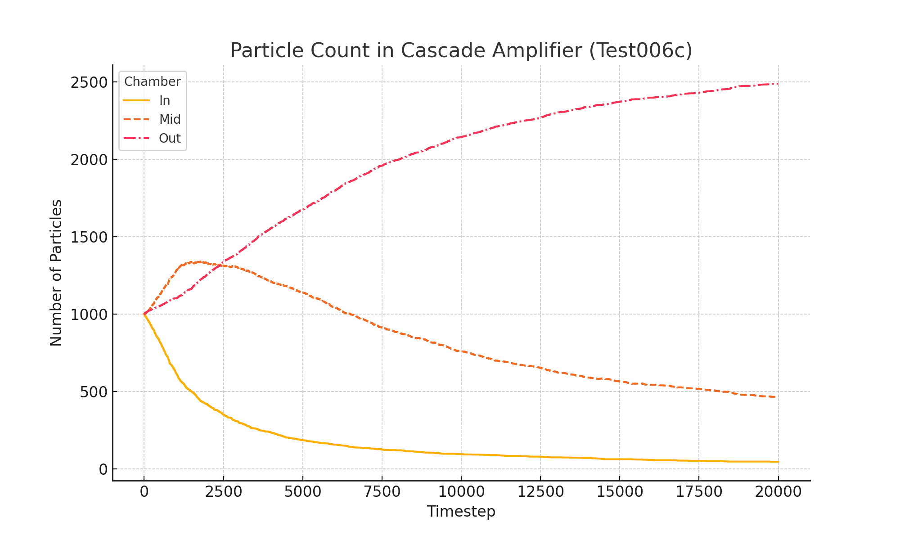

# Experiment Log

## Test 001: Brownian Cube – Uniform Walls

- **Date:** June 18, 2025
- **Repo:** `vortex-box-test`
- **Setup:** All walls reflective. No asymmetry.
- **Outcome:** Uniform distribution. X̄ ≈ 0.0000 m

## Test 002: Brownian Cube – Dual Wall Behavior

- **Date:** June 18, 2025
- **Left walls:** Fully reflective
- **Right walls:** Absorbing (velocity dampened)
- **Result:** ~60–70% particles accumulated in right side
- **X̄:** ≈ +0.03 m
- **Insight:** Geometric asymmetry alone caused spatial bias.

## Test 003 – Heat Drift Geometry (Smart Passive Cooling)

- **Date**: June 18, 2025
- **Type**: Conceptual prototype for passive thermal drift
- **Setup**:
  - 3D rectangular room (~1m³ virtual space)
  - Left wall: reflective
  - Right wall: absorbent
  - Top corner: open drift zone ("chimney exit")
- **Particles**: Simulated air molecules (Brownian agents)
- **Hypothesis**:  
  A geometrically biased interior will passively shift particles (thermal energy) toward an exit zone, simulating passive cooling through boundary-driven accumulation.

- **Expected behavior**:  
  Net drift of particles toward the right-upper corner, where exit/absorption occurs — even without external gradients.

- **Goal**:  
  Demonstrate that asymmetry + boundary design can produce thermal biasing usable in tiny/smart homes.

## Test004 – Terrace Wall Drift (Passive Thermal Repulsion)

- **Date**: June 19, 2025
- **Type**: Digital simulation (from `vortex-box-test` project)
- **Objective**: Evaluate if a terrace-facing reflective wall can induce passive thermal drift
- **Geometry**:

  - 1 m³ virtual box
  - Reflective wall at x = 0 (simulated elastic rebound amplification)
  - Open "exit zone" at x > 0.9 and y > 0.9

- **Key Insight**:
  Elastic acceleration on one side promotes particle movement toward the exit, replicating a cooling effect
  through spatial bias — without any external energy input.

- **Results integrated in**:

  - [Results summary](03_results.md#test004--terrace-wall-drift)
  - [Future plans](04_future_plans.md#smart-passive-wall-cooling)

## 🧪 Test005 – Flow Amplifier Chamber (with Logging)

- **Date**: July 4, 2025
- **Goal**: Test directional particle drift induced by dual-wall asymmetry and a central funnel-type opening.
- **Chamber size**: 40×20×10 units
- **Exit geometry**: 4 units wide, 6 units tall, center-right
- **Particle count**: 100 (initial)
- **Method**: VPython simulation + CSV logging (`test005_flow_amplifier_logged.py`)
- **Outcome**: Directional accumulation and exit were confirmed. See results and plot.

📎 Related files:

- [`heat_drift_exit_data.csv`](../results/test005/heat_drift_exit_data.csv)
- [`test005_exit_plot.png`](../results/test005/test005_exit_plot.png)
- [Simulation source](https://github.com/gavianu/vortex-box-test/blob/main/test005_flow_amplifier/test005_flow_amplifier_logged.py)

---

## 🔹 Test006 – Cascade Flow Amplifier

- **Date**: July 9, 2025
- **Configuration**: Three chambers aligned horizontally:
  - `IN` chamber with **two small elastic funnels** directing flow toward `MID`.
  - `MID` chamber with **fully elastic walls** and a single funnel leading to `OUT`.
  - `OUT` chamber with absorptive walls (acts as the terminal collector).
- **Particles**: 1000 per chamber (initial equilibrium distribution).
- **Mechanism**: Funnels and elastic walls promote **biased migration** from left to right.

**Objective**:  
To test whether multi-chamber elastic guidance amplifies net particle drift and supports step-wise accumulation in the final `OUT` chamber.

**Files**:

- Simulation: [`test006c_cascade_flow_v5.py`](https://github.com/gavianu/vortex-box-test/blob/main/test006_cascade_amplifier/test006c_cascade_flow_v5.py)
- Data CSV: [`test006c_cascade_flow_v5_data.csv`](../results/test006/test006c_cascade_flow_v5_data.csv)
- Screenshot: 
- Plot: 

---

## 🔹 Test007 – Passive Amplifier Zone

- **Date**: July 10–12, 2025
- **Goal**: Demonstrate net directional Brownian motion using purely passive geometries with no logical gates, valves, or external bias.
- **Setup Summary**:

  - `IN` chamber: elastic (acceleration 1.2×).
  - `MID` zone: tunnel made from chained cylinders with varying radius and surface type.
  - Tunnels include:
    - **tubIN**: slightly resistive (0.85×)
    - **cylTunnel3 → cylTunnel1**: vary from absorbent to elastic across models.
    - **tubOUT**: strong elastic acceleration (1.5×).
  - `OUT` chamber: strong deceleration (0.55×).

- **Key Variants**:

  - `Model 1–9`: progressive tuning of funnel shape and material.
  - `Model 10`: full absorbing tunnel sequence.
  - `Model 11`: **all tunnels elastic** – _best net flow observed_.
  - `Model 12`: elastic sequence with one absorbing tunnel to contrast.

- **Comparison Experiments**:
  - `symmetric_flow`: symmetric setup → no net movement.
  - `passive_cascade` (Test006): logical valve-like cascade, less efficient than Model 11.

📸 Visual References:

| Configuration Type   | Screenshot                                                                                        |
| -------------------- | ------------------------------------------------------------------------------------------------- |
| Symmetric (no flow)  |                   |
| Passive Amplifier 11 |  |

📁 Files:

- CSVs: `test007_amplifier_zone_model_[1–12].csv`
- Source: `vortex-box-test/test007_amplifier_zone/`
- Graphs: See `03_results.md` for comparative plots

---

## Test008: Loop Flow Amplifier

- **Date**: July 12–14, 2025
- **Goal**: Demonstrate net directional Brownian motion using purely passive geometries with no logical gates, valves, or external bias.
- **Setup Summary**:

  - `IN` chamber: elastic (acceleration 1.2×)
  - `MID` zone: tunnel made from chained cylinders with varying radius and surface type
  - Tunnels:
    - `tube`: slightly resistive (0.85×)
    - `funnel3 → funnel1`: variable geometry, tuned in different models
    - `funnel0`: connector to output
    - `out_tube`: strong elastic acceleration (1.5×)
  - `OUT` chamber: strong deceleration (0.55×)
  - Loop path (`loop_tube`, `in_loop_tube`, `out_loop_tube`) allows feedback recycling of particles back into the system.

- **Variants Tested**:

  - **Model 1**: neutral loop (no amplification)
  - **Model 2**: strong elastic loop (amplified flow observed)
  - **Model 3**: strong absorbing loop (flow dampened)

- **Result**:
  - Model 2 yielded the **strongest OUT throughput**, confirming that loop elasticity supports directional bias.
  - The system exhibits **fluid-like particle flow**, with measurable zone transitions and repeatable current formation.

A large-scale model simulating a closed-loop passive structure using only geometrical constraints and elastic/absorbing walls. Designed to test whether directional Brownian motion can be amplified in a loop.

📂 [See results](03_results.md#test008-loop-flow-amplifier--results)  
📈 [Transition heatmap](../results/test008/zone_transition_heatmap.png)  
📈 [Flow graph](../results/test008/transition_graph.png)  
📈 [Zone evolution](results/zone_counts_over_time.png)

➡️ The experiment demonstrates that **net flow from IN to OUT is possible**, with amplification due to **loop-tube recycling** and **elastic acceleration** through the central funnel.

**Resources:**

- [zone_transitions.csv](../results/test008/zone_transitions.csv)
- [test008_loop_flow_model_absorbing_passive_amplification2.csv](../results/test008/test008_loop_flow_model_absorbing_passive_amplification2.csv)
- [zone_transitions_summary.csv](../results/test008/zone_transition_summary.csv)

---

↩️ [Back to top](#)  
⬅️ [Back to index](../index.md)
