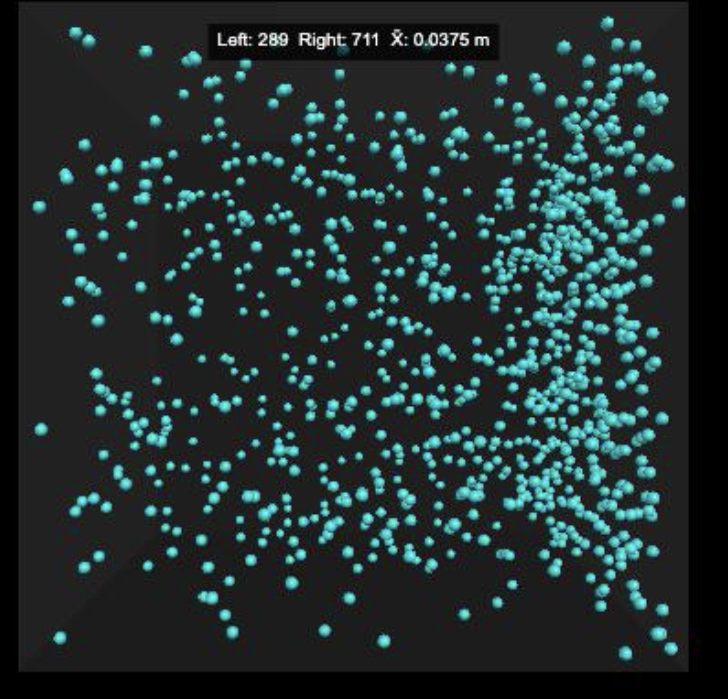
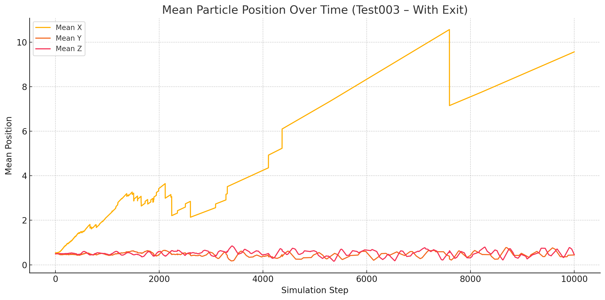

# Experimental Results Summary

| Test # | Description         | Net Flow  | X̄ Position | Notes                         |
| ------ | ------------------- | --------- | ---------- | ----------------------------- |
| 001    | Uniform cube        | None      | ~0.0000 m  | Baseline for Brownian chaos   |
| 002    | Dual-wall asymmetry | Rightward | ~+0.03 m   | Passive entropic accumulation |

### Interpretation

The results suggest that **directional accumulation** can occur in completely random systems when **geometric or material asymmetries** are present — a principle that could lead to energy guiding or harvesting systems at the nanoscale.

### Test002 – Dual-wall asymmetry

- 

### Test003 – Heat Drift with Exit

- Extended to 10,000 steps
- Chimney-like exit defined at top-right (x > 0.90, y > 0.90)
- Significant drift detected

Output:

- [CSV log](../results/heat_drift_with_exit_positions.csv)
- [📈 Position plot](../results/test003_mean_position_plot.png)

#### Test003 Results Summary

The inclusion of an asymmetric "exit" region at the top-right corner leads to a visible shift in the mean particle positions, confirming the geometric biasing hypothesis.

👉 See [04_future_plans.md](./04_future_plans.md) for product applications and prototyping.

[↑ Back to top](#)
[← Back to index](../index.md)
