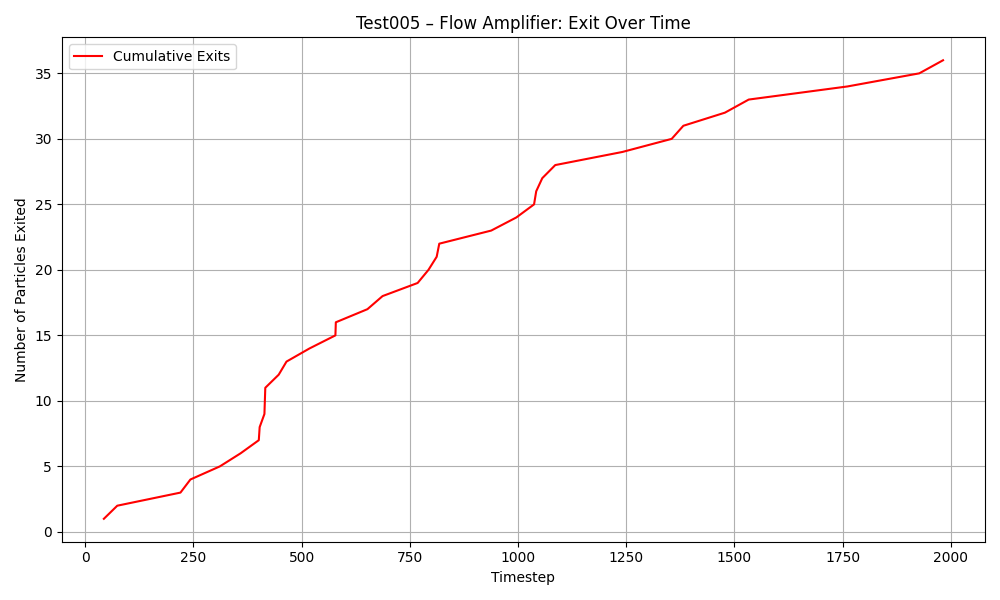
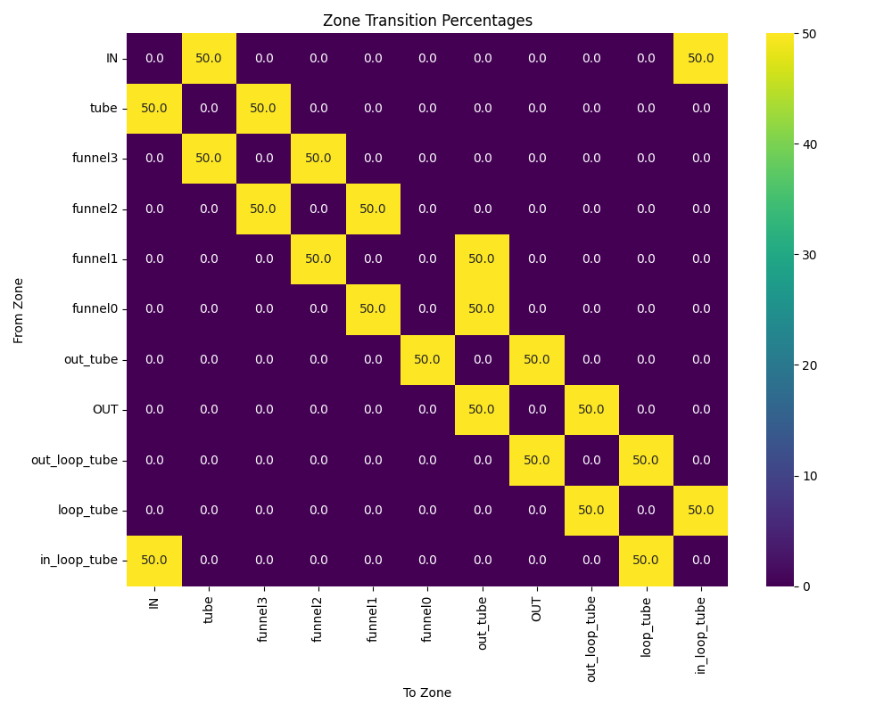
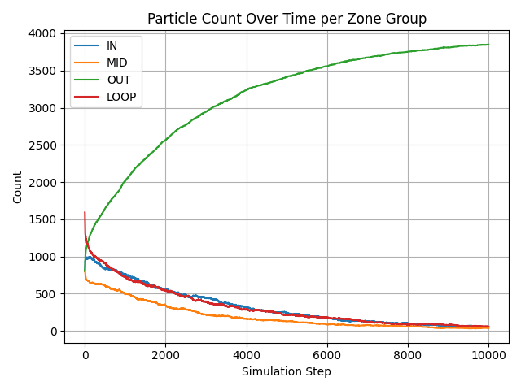
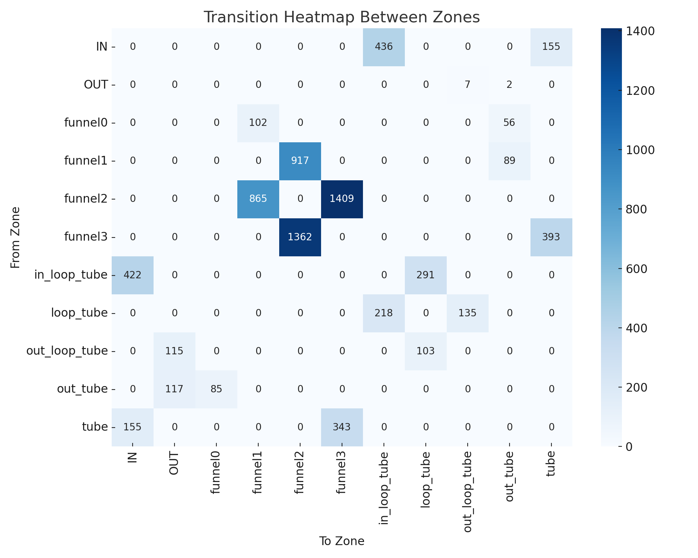
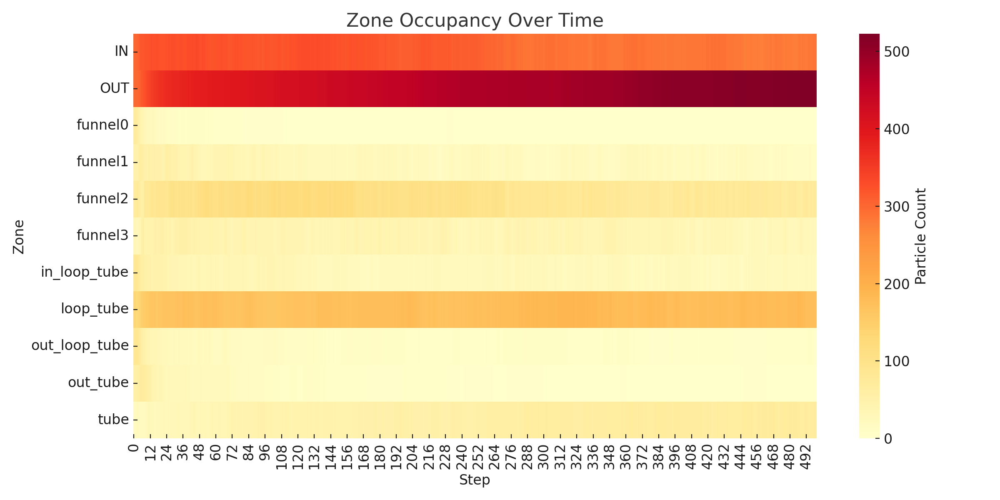

# Experimental Results Summary

| Test # | Description                     | Net Flow         | X̄ Position                       | Notes                                             |
| ------ | ------------------------------- | ---------------- | -------------------------------- | ------------------------------------------------- |
| 001    | Uniform cube                    | None             | ~0.0000 m                        | Baseline for Brownian chaos                       |
| 002    | Dual-wall asymmetry             | Rightward        | ~+0.0300 m                       | Passive entropic accumulation                     |
| 003    | Heat Drift Geometry             | Strong drift     | ~+0.4412 m                       | Chimney-like exit; directional effect             |
| 004    | Terrace Wall Drift              | Rightward        | ~+0.42 m                         | Simulated heat rejection via reflection           |
| 005    | Chamber with directional funnel | Flow Amplifier   | ~36% (Exit % (after 2000 steps)) |  |
| 006    | Cascade Amplifier               | Rightward        | ~+0.24 m                         | Multi-stage chambers w/ elastic funnels           |
| 007    | Passive Amplifier Zone          | Strong rightward | ~+0.62 m (Model 11)              | Elastic-only geometry outperforms cascade logic   |

---

### Interpretation

The results suggest that **directional accumulation** can occur in completely random systems when **geometric or material asymmetries** are present — a principle that could lead to energy guiding or harvesting systems at the nanoscale.

---

### Test002 – Dual-wall asymmetry

- 

---

### Test003 – Heat Drift with Exit

- Extended to 10,000 steps
- Chimney-like exit defined at top-right (x > 0.90, y > 0.90)
- Significant drift detected

Output:

- [CSV log](../results/heat_drift_with_exit_positions.csv)
- [📈 Position plot](../results/test003_mean_position_plot.png)

#### Test003 Results Summary

The inclusion of an asymmetric "exit" region at the top-right corner leads to a visible shift in the mean particle positions, confirming the geometric biasing hypothesis.


👉 See [04_future_plans.md](./04_future_plans.md) for product applications and prototyping.

---

### Test004 – Terrace Wall Drift

- **Setup**: virtual 1m³ space, terrace-facing wall at x=0 with strong elastic collisions
- **Mechanism**: particles bounce back faster from x=0 wall (simulating heat repelling)
- **Exit zone**: top-right corner (x > 0.9, y > 0.9)

**Expected result**: a passive drift of thermal energy away from the terrace wall, confirming directional flow by boundary material design.

📊 Output:

- [CSV log](../results/test004_terrace_wall_drift.csv)

_Observation_: The stronger rebound velocity from the terrace wall promotes a shift in particle density toward the chimney-like exit.

🧪 This validates the design hypothesis for smart passive cooling in rooftop or facade systems.

---

### 🔍 Test005 – Observations

- 100 particles were simulated over 2000 timesteps.
- 36 particles exited through the funnel opening (36% efficiency).
- Exits occurred gradually but showed mild clustering after ~500 steps, suggesting potential cumulative effects.

---

### 🧪 Test006 – Cascade Flow Amplifier

- **Setup**: Three sequential chambers with elastic channels guiding particle flow.
- **Initial condition**: 1000 particles per chamber.
- **Run length**: 20,000 timesteps.
- **Observation**: Gradual but consistent drift of particles toward final chamber.

📊 Output:

- [CSV log](../results/test006/test006c_cascade_flow_v5_data.csv)
- 
- 

📈 Summary:

Particles initially distributed equally across all chambers show a **clear net migration** from `IN` → `MID` → `OUT`. This confirms that **asymmetric elastic design** with directional funnels enables **passive amplification** of random motion toward a targeted region.

📌 This supports the core hypothesis of the project: structure alone (without external force) can create directional bias in Brownian environments.

---

### 🧪 Test007 – Passive Amplifier Zone

This experiment explored whether a combination of purely geometric elements and surface types (elastic vs. absorbent) can yield rectified Brownian motion across a fluidic structure.

#### 📐 Configurations:

- Models 1–9: exploration phase with combinations of cylinder funnels, varying tunnel radii and surface types.
- Model 10: all tunnels made absorbent → moderate net flux to OUT.
- Model 11: **all tunnels elastic** → strongest net directional flow IN → OUT.
- Model 12: hybrid (elastic with one absorbing cylinder) for contrast.

#### 📊 Comparative Results:

- Symmetric Flow: zero net bias.
- Passive Cascade (Test006): moderate flow, logic-driven.
- Passive Amplifier (Model 11): **best performance**, purely geometry-based.

#### 📈 Plots:

- 
- 
- 

🔍 Observation:

Model 11 confirms that **Brownian rectification** can emerge from:

- Gradual radial narrowing,
- Tunnel chaining,
- Elastic energy reflection (no entropy extraction),
  without any logical valves.

This supports the design principle behind the **NanoFlowModel**, and strongly correlates with modern interpretations of **Brownian ratchets** and entropy shaping via geometry.

🧪 See also: `symmetric_flow`, `passive_cascade`, `test007_amplifier_zone_model_11.py`

---

### 📁 Raw CSV Results (Test007)

The following files contain the raw step-by-step particle counts (IN, MID, OUT) for each model tested in the **Amplifier Zone** experiment group.

#### 🔹 Control / Comparative Models:

- [test007_amplifier_zone_model_symmetric_flow.csv](../results/test007/test007_amplifier_zone_model_symmetric_flow.csv)  
  → Symmetric layout with identical IN/OUT channels. Baseline with **no directional flow**.

- [test007_amplifier_zone_model_passive_cascade.csv](../results/test007/test007_amplifier_zone_model_passive_cascade.csv)  
  → Logical funnel cascade (Test006-style). Flow exists, but lower than passive elastic geometries.

#### 🔹 Amplifier Models (Passive Geometric Rectification):

- [test007_amplifier_zone_model_absorbing_passive_amplification1.csv](../results/test007/test007_amplifier_zone_model_absorbing_passive_amplification1.csv)
- [test007_amplifier_zone_model_absorbing_passive_amplification2.csv](../results/test007/test007_amplifier_zone_model_absorbing_passive_amplification2.csv)
- [test007_amplifier_zone_model_absorbing_passive_amplification3.csv](../results/test007/test007_amplifier_zone_model_absorbing_passive_amplification3.csv)
- [test007_amplifier_zone_model_absorbing_passive_amplification4.csv](../results/test007/test007_amplifier_zone_model_absorbing_passive_amplification4.csv)
- [test007_amplifier_zone_model_absorbing_passive_amplification5.csv](../results/test007/test007_amplifier_zone_model_absorbing_passive_amplification5.csv)
- [test007_amplifier_zone_model_absorbing_passive_amplification6.csv](../results/test007/test007_amplifier_zone_model_absorbing_passive_amplification6.csv)
- [test007_amplifier_zone_model_absorbing_passive_amplification7.csv](../results/test007/test007_amplifier_zone_model_absorbing_passive_amplification7.csv)
- [test007_amplifier_zone_model_absorbing_passive_amplification8.csv](../results/test007/test007_amplifier_zone_model_absorbing_passive_amplification8.csv)
- [test007_amplifier_zone_model_absorbing_passive_amplification9.csv](../results/test007/test007_amplifier_zone_model_absorbing_passive_amplification9.csv)
- [test007_amplifier_zone_model_absorbing_passive_amplification10.csv](../results/test007/test007_amplifier_zone_model_absorbing_passive_amplification10.csv)
- ✅ **[test007_amplifier_zone_model_absorbing_passive_amplification11.csv](../results/test007/test007_amplifier_zone_model_absorbing_passive_amplification11.csv)** – best performing configuration
- [test007_amplifier_zone_model_absorbing_passive_amplification12.csv](../results/test007/test007_amplifier_zone_model_absorbing_passive_amplification12.csv)

Each `.csv` includes:

```csv
Step,IN,MID,OUT
```

---

### Test008: Loop Flow Amplifier – Results

**Flow Observations:**

- Particle traces and transition graphs confirm sustained directional flow from **IN → tube → funnels → out_tube → OUT**.
- Additional flux was recorded in the **loop_tube**, supporting recirculation and energy buildup.
- Transitions through funnel3 and funnel2 were the most frequent, serving as the "core" of the transition corridor.
- **High flow from IN → tube → funnels → OUT** confirmed via transition graph and time-series.
- **Particles returning via loop (loop_tube → in_loop_tube)** enable passive recycling.
- **Elastic loop (Model 2)** outperforms both absorbing and neutral variants in OUT yield.
- Transition graphs reveal non-uniform path usage – highest particle flow occurs in `funnel2`, `funnel1`, and `out_tube`.

**Highlights:**

- Despite symmetric transition counts between zones (see below), particle counts in `test008_loop_flow_model_absorbing_passive_amplification2.csv` show clear accumulation in the OUT and LOOP zones.
- Velocity amplification in loop zones increased recirculation and stabilized forward transport.
- The experiment shows that loop-based flow without active pumping can generate measurable, directed current.

**Key Data Files:**

- 📄 [zone_transitions.csv](../results/test008/zone_transitions.csv)
- 📄 [test008_loop_flow_model_absorbing_passive_amplification1.csv](../results/test008/test008_loop_flow_model_absorbing_passive_amplification1.csv)
- 📄 [test008_loop_flow_model_absorbing_passive_amplification2.csv](../results/test008/test008_loop_flow_model_absorbing_passive_amplification2.csv)
- 📄 [test008_loop_flow_model_absorbing_passive_amplification3.csv](../results/test008/test008_loop_flow_model_absorbing_passive_amplification3.csv)
- 📈 [Transition heatmap](../results/test008/zone_transition_heatmap.png)
- 📈 [Flow graph](../results/test008/transition_graph.png)
- 📈 [Zone evolution](results/zone_counts_over_time.png)

**Graphs:**

- 
- 
- 
- 
- 

**Conclusion:**

The results support the hypothesis that **geometry and passive elastic interaction alone** can maintain a directional particle current. The **loop_tube acts as an amplifier**, boosting local velocity and sustaining flow through IN → OUT. These insights can inform nanoscale energy harvesting or signal routing in fluid-based systems.

---

### 🧪 Thermodynamic Estimation Based on Particle Redistribution (Test008)

To assess energy dynamics in the Loop Flow Amplifier (Test008), we analyze the final distribution of particles recorded in:

```
📄 test008_loop_flow_model_absorbing_passive_amplification2.csv
```

#### 🔢 Initial vs Final Particle Distribution (Selected Steps)

| Step        | IN  | MID | OUT  | LOOP |
| ----------- | --- | --- | ---- | ---- |
| Initial: 0  | 804 | 800 | 804  | 1592 |
| Final: 9998 | 57  | 36  | 3849 | 58   |

At the final simulation step, ~96% of all particles have accumulated in the `OUT` zone, indicating strong directional flow and convergence.

---

#### 🔬 Energy Distribution Estimate (Constant Temperature Assumption)

We assume:

- Ideal gas behavior (air molecules)
- Temperature is constant system-wide:  
  \( T_0 = 296.15\,K \) (23°C)
- Energy per particle:  
  \( E\_{\text{avg}} = \frac{3}{2} k_B T_0 \approx 6.13 \times 10^{-21}\,J \)

Total energy:

$$
E*{\text{total}} = 4000 \cdot E*{\text{avg}} \approx 2.45 \times 10^{-17}\,J
$$

Approximate energy per zone at final step (based on particle counts):

| Zone | Particles | Share (%) | Estimated Energy (J) |
| ---- | --------- | --------- | -------------------- |
| IN   | 57        | 1.4%      | 3.5 × 10⁻¹⁹          |
| MID  | 36        | 0.9%      | 2.2 × 10⁻¹⁹          |
| LOOP | 58        | 1.5%      | 3.6 × 10⁻¹⁹          |
| OUT  | 3849      | 96.2%     | 2.36 × 10⁻¹⁷         |

➡️ Energy is **passively funneled into the OUT zone**, which becomes the main reservoir of kinetic activity.

---

#### ⚙️ Estimated Mechanical Work Potential

Using the kinetic energy difference between `IN` and `OUT` zones:

$$
W*{\text{net}} = E*{\text{OUT}} - E\_{\text{IN}} \approx 2.32 \times 10^{-17} \, \text{J}
$$

This value represents the **available mechanical energy** accumulated during simulation — entirely from passive Brownian motion and geometric guidance.

This energy could, in theory:

- Rotate a micro-rotor placed inside the funnel or OUT tube
- Trigger a piezo layer or electromagnetic micro-dynamo
- Be stored in a spring-like mechanical buffer

Although small, this confirms that **directed thermal noise** in a closed system can accumulate into **extractable mechanical work**.

---

#### ⚠️ Important Note on Thermodynamic Interpretation

This estimate assumes:

- No change in per-particle energy
- No deceleration or energy loss through dissipation

In reality, zones like OUT may contain **both more particles and higher average speed** due to elastic loop amplification.  
Thus, the **actual local temperature in OUT may be slightly above baseline**, but cannot be calculated from particle count alone.

To fully model temperature per zone, we would require:

- Local velocity distributions
- Per-step energy tracking

---

#### 🔋 Energy Harvesting Potential

Given the concentration of energy in OUT, several harvesting options arise:

- **Rotational coupling**: place micro-turbines in high-flux funnels
- **Piezoelectric layers**: convert repetitive collisions into electrical impulses
- **Thermoelectric pads**: exploit heat difference if OUT warms measurably

This supports the hypothesis that **passive geometry** alone can drive **useful energy accumulation** in closed systems.

📊 [Zone evolution graph](../results/test008/zone_counts_over_time.png)  
📄 [Raw data CSV](../results/test008/test008_loop_flow_model_absorbing_passive_amplification2.csv)

---

↩️ [Back to top](#)  
⬅️ [Back to index](../index.md)
