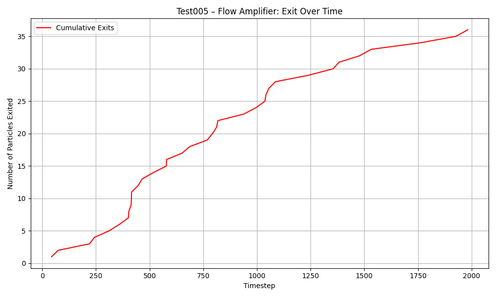

# NanoFlowModel – Bachelor Thesis Draft

**Author**: Octavian Știrbei  
**Field**: Applied Physics – Nanotechnology, Metrology and Surface Optics  
**Faculty**: University of Bucharest, Faculty of Physics  
**Supervisor**: _(to be assigned)_  
**Academic Year**: 2024–2025

---

## Abstract

This thesis explores the possibility of extracting order from thermal noise by designing structured nano-geometries. Inspired by biological systems and theoretical models of entropic transport, this research evaluates the potential of passive geometries to produce flow bias or energy directionality at microscale.

---

## Table of Contents

1. [Introduction](docs/00_introduction.md)
2. [Physics Context and Theoretical Background](docs/01_physics_context.md)
3. [NanoFlowModel Design Hypothesis](README.md)
4. [Experimental Setup and Simulation Method](docs/02_experiment_log.md)
5. [Results and Interpretation](docs/03_results.md)
6. [Theoretical Framework and Analytical Model](docs/05_theory_and_model.md)
7. [Applications and Future Work](docs/04_future_plans.md)
8. [Conclusion](#conclusion)
9. [References](references/papers.md)

---

## Theoretical Framework and Analytical Model

This section presents the mathematical principles and physical models that support the simulation experiments in this thesis. Starting from the stochastic behavior of Brownian particles, it includes:

- Mean squared displacement (MSD) and diffusion models
- Langevin and Fokker–Planck equations
- Continuity in flow and particle density
- Restitution coefficients in collision modeling

For full derivations and interpretations, see:  
→ [05_theory_and_model.md](docs/05_theory_and_model.md)

## Conclusion

The preliminary results demonstrate spatial particle accumulation purely from asymmetric boundary interactions. This supports the hypothesis that local entropy reduction is possible by intelligent design alone, without violating thermodynamic laws.

Further simulation and nano-engineering steps are needed to approach practical energy or propulsion prototypes.

See [papers.md](references/papers.md) for full citations and scientific background.

---

## Appendix

- Code repository: [vortex-box-test](https://github.com/yourusername/vortex-box-test)
- Simulation parameters, figures, and logs will be added in final submission.
- Plot: Dual-Wall Asymmetry – [📈 View Graph](results/test002_dual_wall_asymmetry_plot.png)
- Plot: Heat Drift Mean Position – [📈 View Graph](results/test003_mean_position_plot.png)
- Conceptual poetry reflecting the origins of NanoFlow:  
  → ["Independent și liber (Natura)”](docs/poetry.md)

  #### Appendix B – Test005: Flow Amplifier Results

- Data file: [heat_drift_exit_data.csv](./results/test005/heat_drift_exit_data.csv)
- Plot:  
  

Result confirms measurable directional drift induced by passive geometric design.

↩️ [Back to top](#)  
⬅️ [Back to index](index.md)
