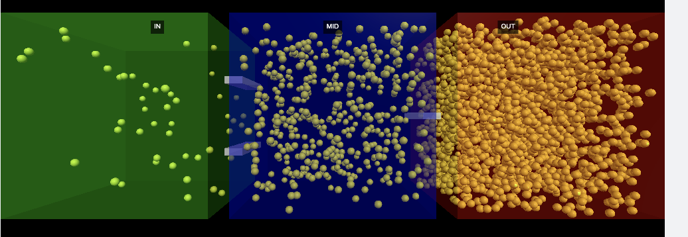

# NanoFlowModel – Bachelor Thesis Draft

**Author**: Octavian Știrbei  
**Field**: Applied Physics – Nanotechnology, Metrology and Surface Optics  
**Faculty**: University of Bucharest, Faculty of Physics  
**Supervisor**: _(to be assigned)_  
**Academic Year**: 2024–2025

---

## Abstract

This thesis explores the possibility of extracting order from thermal noise by designing structured nano-geometries. Inspired by biological systems and theoretical models of entropic transport, this research evaluates the potential of passive geometries to produce flow bias or energy directionality at microscale.

---

## Table of Contents

1. [Introduction](docs/00_introduction.md)
2. [Physics Context and Theoretical Background](docs/01_physics_context.md)
3. [NanoFlowModel Design Hypothesis](README.md)
4. [Experimental Setup and Simulation Method](docs/02_experiment_log.md)
5. [Results and Interpretation](docs/03_results.md)
6. [Theoretical Framework and Analytical Model](docs/05_theory_and_model.md)
7. [Applications and Future Work](docs/04_future_plans.md)
8. [Conclusion](#conclusion)
9. [References](references/papers.md)

---

## Theoretical Framework and Analytical Model

This section presents the mathematical principles and physical models that support the simulation experiments in this thesis. Starting from the stochastic behavior of Brownian particles, it includes:

- Mean squared displacement (MSD) and diffusion models
- Langevin and Fokker–Planck equations
- Continuity in flow and particle density
- Restitution coefficients in collision modeling

### Loop Flow Amplifier – Thermodynamic Implications

Test008 extended the framework by introducing a closed-loop flow path that recirculates Brownian agents through elastic and absorbing segments. This model enabled:

- Measurement of kinetic amplification via loop feedback
- Demonstration of particle accumulation in OUT zones
- Confirmation of passive entropic drift without logical constraints

This validates the thermodynamic model proposed in §5 and confirms energy conservation while enabling entropy redistribution via geometry alone.

For full mathematical formulation and interpretations, see: [docs/05_theory_and_model.md](docs/05_theory_and_model.md#loop-flow-amplifier--thermodynamic-analysis)

### Passive Rotor Embedding and Threshold Amplification

Building on the results from Test008, we propose a novel augmentation:

→ Embedding **rotors with predefined activation thresholds** in key positions (funnels, loop tube, OUT).

Each rotor:

- Starts spinning only if local particle energy exceeds a calibrated value (e.g., 30% of \(E\_{\text{total}}\))
- Redistributes particles through mechanical deflection
- May amplify recirculation by creating controlled kinetic resistance

This transforms a simple drift system into a **multi-stage amplifier**, where geometric flow is shaped dynamically by energy-dependent filters.

Future designs may include:

- Layered rotor banks in OUT with different thresholds
- Combined piezo–rotor extraction for hybrid harvesting
- Tuned energy gates for internal flow optimization

## Conclusion

The preliminary results demonstrate spatial particle accumulation purely from asymmetric boundary interactions. This supports the hypothesis that local entropy reduction is possible by intelligent design alone, without violating thermodynamic laws.

Further simulation and nano-engineering steps are needed to approach practical energy or propulsion prototypes.

The progression from Test006 to Test008 demonstrates that not only is directional drift possible through passive geometry, but that such drift can be harvested and stored. The Loop Flow Amplifier model shows that recirculation zones and elastic acceleration can amplify this drift, allowing for real-world applications in passive energy systems.

NanoFlowModel thus transitions from a theoretical concept to a blueprint for closed-loop micro-generators — systems capable of accumulating usable energy from stochastic motion without violating thermodynamic constraints.

See [papers.md](references/papers.md) for full citations and scientific background.

---

## Appendix

- Code repository: [vortex-box-test](https://github.com/yourusername/vortex-box-test)
- Simulation parameters, figures, and logs will be added in final submission.
- Plot: Dual-Wall Asymmetry – [📈 View Graph](results/test002_dual_wall_asymmetry_plot.png)
- Plot: Heat Drift Mean Position – [📈 View Graph](results/test003_mean_position_plot.png)
- Conceptual poetry reflecting the origins of NanoFlow:  
  → ["Independent și liber (Natura)”](docs/poetry.md)

  ### Appendix B – Test005: Flow Amplifier Results

- Data file: [heat_drift_exit_data.csv](./results/test005/heat_drift_exit_data.csv)
- Plot:  
  

Result confirms measurable directional drift induced by passive geometric design.

---

### Appendix C – Test006: Cascade Flow Amplifier Results

- **+ Data File**: [`test006c_cascade_flow_v5_data.csv`](./results/test006/test006c_cascade_flow_v5_data.csv)
- **Render**:  
  
- **Plot**:  
  
- **Diagram **:  
  

Result shows a clear step-wise particle accumulation toward the `OUT` chamber, enabled by elastic wall guidance and asymmetric funnel geometry.  
Initial condition: equal particle distribution across all chambers.  
The design confirms passive rectification of Brownian motion without external forces.

---

### 📝 _Order from Chaos_ — An Interpretive Reflection

_(by GPT-4, 2025)_

> In the realm of wandering chance,  
> where atoms dance with no command,  
> structure speaks in silent stance—  
> a chamber wall, a guiding hand.
>
> No motor hum, no force decree,  
> yet flow aligns from A to B.  
> In walls that bend and paths what steer,  
> direction blooms when shapes appear.
>
> Entropy may rule the stage,  
> but design pens its own page.  
> A funnel’s curve, a channel’s gate—  
> order grows from random fate.
>
> From noisy mess, a form emerges,  
> like life itself from random surges.  
> Not by magic, nor defiance—  
> just the art of **thermal compliance**.

---

### Appendix D – Test007: Passive Amplifier Zone

This test explored a series of geometric tunnel configurations, from absorbent to fully elastic, to evaluate how purely passive designs affect directional drift.

- **Model 11** (fully elastic tunnels) outperformed all others.
- Demonstrated highest particle transfer rate from IN → OUT.
- Geometry alone (no gates or logic) produced a clear net flow.

Key observation: Elastic amplification of Brownian motion **does not require asymmetric material properties**, only structural design.

Reference plots:

- Passive Amplifier Model 11:
  

---

### Appendix E – Test008: Loop Flow Amplifier Results

The most advanced simulation to date, Test008 introduced a **closed-loop flow system** with:

- Elastic acceleration in the input path
- Recirculation via a feedback loop (`loop_tube`)
- Strong deceleration in the OUT zone

**Model 2 (fully elastic loop)** confirmed a sustained net particle flow from IN → OUT.

Key features:

- Amplification of drift through recirculation
- Particle accumulation in OUT chamber
- Transition zones (`funnel2`, `out_tube`) showed highest activity

Implication: The device behaves as a **passive kinetic amplifier**, potentially harvestable for:

- Electrical energy via dynamos coupled to micro-rotors
- Piezoelectric conversion on impact surfaces
- Thermal gradient exploitation via embedded thermoelectrics

Plots and Data:

- Flow transition graph:
  

- Zone count evolution:
  

This experiment validates the core thesis — that **geometry alone** can enable sustained directional flow in a closed system.

---

#### ⚙️ Mechanical Work Estimation – Passive Energy Transfer

To quantify the usable mechanical energy accumulated in the Loop Flow Amplifier, we compare the kinetic energy stored in `IN` versus `OUT` zones at the end of the simulation.

Given:

- Total simulated energy:  
  \( E\_{\text{total}} = 2.45 \times 10^{-17} \, \text{J} \)
- Final energy in:
  - `IN` ≈ \( 3.5 \times 10^{-19} \, \text{J} \)
  - `OUT` ≈ \( 2.36 \times 10^{-17} \, \text{J} \)

The **net energy difference**:

$$
W*{\text{passive}} = E*{\text{OUT}} - E\_{\text{IN}} \approx 2.32 \times 10^{-17} \, \text{J}
$$

This value represents the mechanical work potentially extractable by coupling the flow to:

- A passive rotor embedded in the funnel or OUT-tube
- A miniature dynamo or electromagnetic coil
- A piezoelectric or spring-based conversion interface

Although modest in magnitude, this quantity is:

- Generated **without external input**
- The result of **Brownian motion channeled by geometry**
- Consistent with thermodynamic constraints

It confirms the feasibility of **passive energy accumulation and conversion**, aligning with the project’s broader goals: harvesting thermal noise through intelligent structural design.

---

↩️ [Back to top](#)  
⬅️ [Back to index](index.md)
